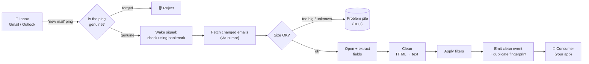

# Features — Prioritized Roadmap

Derived from the architecture-verification pass (`docs/architecture-verification-prompt.md`) and
the expert-panel synthesis. Not everything belongs in V1. Features are bucketed by priority.

---

## Read this first (plain-English overview)

**What is mailflow?**
mailflow is a software *library* — a reusable component other programs plug into. Its job is to
watch an email inbox (Gmail or Microsoft Outlook/Graph), and every time a new email arrives, turn
that messy raw email into a **clean, structured record** that other software can easily use.

Think of it as an **automated mailroom**:

- A letter (email) arrives at the building (the inbox).
- The mailroom is told "you have new mail" (a *notification*).
- A clerk goes and fetches the actual letter, opens the envelope, pulls out the useful contents
  (who sent it, the subject, the text, any attachments), and throws away the junk.
- The clerk hands a tidy summary card to whichever department asked for it (the *consumer* — the
  program using mailflow).

Here is that journey as a picture — the path every email takes through the mailroom:

This document is the **to-do list for building that mailroom** — every capability it needs, sorted
by how urgent it is.

**What is "V1"?**
V1 means "version 1.0" — the first official, stable release. The big deal about V1 is *promises*:
once you publish V1, other teams build their software against it and trust it not to change. So
anything that would force those teams to rewrite their code later **must be settled before V1**.

**Why are features split into tiers?**
Not everything is equally urgent. The tiers (P0–P3) sort features from "the release is broken
without this" down to "nice idea for the distant future." See the tier legend below.

### Words you'll see a lot (mini-glossary)

| Term | Plain meaning |
|---|---|
| **Library / facade** | The reusable code other programs plug into. The "facade" is the simple front door — the easy way to use it. |
| **Consumer** | The program (built by someone else) that *uses* mailflow. |
| **Port** | A defined "shape" of a plug — a contract that says "any component that fits here must have these exact functions." Lets you swap one implementation for another. Like a USB socket: anything USB-shaped fits. |
| **Contract** | A promise about how a piece behaves or what shape it has. Breaking a contract after V1 breaks everyone who relied on it. |
| **Notification / webhook / push** | A message from Gmail/Outlook saying "you have new mail." A *webhook* is the internet plumbing that delivers that ping to your server. |
| **Poll / pull / delta** | Instead of waiting to be pinged, the mailroom periodically *asks* "anything new since last time?" (polling). A *delta* is "what changed since my last check." |
| **Cursor** | A bookmark. It remembers exactly where you stopped reading so you can resume without missing or repeating mail, even after a crash. (Gmail calls its bookmark a `historyId`; Outlook calls it a `deltaLink`.) |
| **DLQ (Dead-Letter Queue)** | The "problem pile." When a message can't be processed (it's broken, too big, or poisonous), it's set aside here instead of jamming the whole line. |
| **Idempotency / idempotency_key** | A guard against double-processing. The `idempotency_key` is a unique fingerprint for each email so that if the same one shows up twice, the consumer knows it's a duplicate and handles it once. |
| **At-least-once vs exactly-once** | Two delivery promises. *Exactly-once* (each email delivered one time, guaranteed) is extremely hard. *At-least-once* (each email delivered, but occasionally twice) is realistic — which is why consumers need the idempotency_key to spot duplicates. |
| **Error taxonomy** | A classification of failures into clear types — *Auth* (login/permission problem), *Permanent* (will never succeed, e.g. the email was deleted), *Transient* (temporary, worth retrying). The system reacts differently to each. |
| **Backoff / retry / Retry-After** | When a server says "too many requests, slow down," good clients wait and try again later, waiting a bit longer each time (*backoff*). *Retry-After* is the server telling you exactly how long to wait. |
| **Throttle / rate limit** | The email provider capping how fast you can ask for things. Ignore it and you get blocked. |
| **Thread key** | The ID that groups a back-and-forth conversation (an email + all its replies) together. |
| **SecretProvider** | The component that hands out passwords/tokens (login credentials) securely, instead of hard-coding them. |
| **Store / BlobStore / CursorStore** | Where things are saved. A *BlobStore* holds big binary files (like attachments). A *CursorStore* holds the bookmarks. |
| **Extractor** | The "clerk" that opens an email and pulls out the structured fields. |
| **EmailEvent / CleanEmail** | The tidy output. `CleanEmail` is the cleaned email; `EmailEvent` is the packaged announcement ("here's a clean email") handed to the consumer. |

### Gmail vs Outlook — where the two providers differ

mailflow aims to work with any email provider, but the **two it supports today behave differently
under the hood.** Wherever a feature only applies to one of them, this doc tags it **(Gmail)** or
**(Outlook)**. One naming note: Microsoft's email API is called **"Microsoft Graph"** (or just
**"Graph"**), so in code and quotes "Graph" always means **Outlook**.

| Capability | Gmail | Outlook (a.k.a. Microsoft Graph) |
|---|---|---|
| Bookmark / cursor | `historyId` | `deltaLink` |
| How the inbox is sliced into streams | one whole-mailbox stream | one stream **per folder** |
| Conversation-grouping ID (thread key) | `threadId` | `conversationId` |
| "New mail" push channel | Google Pub/Sub | Graph subscription + webhook |
| Proving a push ping is genuine | OIDC-JWT (a signed token) | `clientState` secret + `validationToken` handshake |
| "Watch this inbox" subscription lifetime | re-armed daily via `watch()` | capped at **≤ ~4230 min**, renew ~daily |
| Checking an email's size before download | (from the raw message) | Graph extended-property probe |

If a row below is **not** tagged with a provider, assume it applies to both.

---

## How to read this

- **Tier** — when it ships (see legend).
- **V1 needs** — the critical distinction:
  - `Contract` = lock in the port/signature/shape in V1 (a thin or stub version is fine for now),
    because adding or changing it *after* 1.0 **breaks** every consumer who built against it.
    Think: agreeing on the exact shape of a power socket before the whole country wires up to it.
  - `Impl` = a *working implementation* is required in V1 — not just the shape, the actual
    behavior.
  - `Contract + Impl` = both the agreed shape **and** working behavior are needed.
  - `—` = neither is required for V1 (the "socket" may still be designed now so it fits later).

### Tier legend
| Tier | Meaning |
|---|---|
| **P0** | V1 blocker. The release cannot honestly be called "solid & complete" without it. |
| **P1** | V1 should-have. Makes it sturdier; include in V1 if time allows, otherwise do it right after. |
| **P2** | Post-V1. Design the "socket" now so it fits, but build the actual thing in a later round. |
| **P3** | Future / optional. No urgency at all; revisit when someone actually needs it. |

---

## P0 — V1 blockers

### Freeze-now contracts (changing these after 1.0 breaks consumers)

*These are the promises that must be nailed down before release. Each note explains the rule in
plain terms.*

| Feature | V1 needs | What it means |
|---|---|---|
| "Notifications are wake-signals only" rule **(A1 — Gmail complies; Outlook rewire ⏸️ deferred)** | Contract + Impl | **The golden rule.** A "you have mail" ping should only ever mean *"go check using your bookmark"* — never *"fetch exactly this one email by the ID in the ping."* Pings can be faked or arrive out of order; the bookmark is the trustworthy source. *(Gmail already obeys this; the Outlook rewire is deferred to the fast-follow — see the locked-scope section.)* |
| Typed error taxonomy (Auth/Permanent/Transient) | Contract + Impl | Sort failures into three clear buckets so the system reacts correctly: a permission problem (re-login), a permanent failure (give up, set aside), or a temporary glitch (wait and retry). |
| Cursor contract (durable bookmark, always moves forward, advances to last-processed) | Contract + Impl | The bookmark must survive a crash, never slide backward, and always point to the last email actually handled. Gmail=`historyId`, Outlook=`deltaLink` — never a flimsy page-token. |
| Identity & idempotency_key on EmailEvent | Contract | Stamp every outgoing email with a unique fingerprint — `(tenant, mailbox, provider_message_id)` — so consumers can spot duplicates. And honestly document that delivery is *at-least-once*. |
| WebhookVerifier port (proves a "new mail" ping is genuine) | Contract + Impl | A way to check that a ping really came from Gmail/Outlook and isn't a forgery. (Graph uses a shared secret + handshake; Gmail uses a signed token.) |
| ContentCleaner port (thin HTML→text default) | Contract + Impl | A standard, swappable step that turns an email's HTML into readable plain text. The default is *gentle* cleaning; aggressive stripping is opt-in, never forced. |
| Provider-native thread key on CleanEmail | Contract | Carry the conversation-grouping ID (Gmail `threadId` / Outlook `conversationId`) so replies can be tied to the original, with a subject-line fallback. |
| Widened SecretProvider (per-tenant, per-mailbox login, saves rotated tokens) | Contract | The credential-handler must support multiple customers and mailboxes, and **save** refreshed login tokens. A renewed token that isn't saved silently breaks the *next* run. |
| Builder `overrides=` + `as_filter`/`as_cleaner` sugar | Contract + Impl | Easy ways to plug your own custom pieces in, so the features below work *without* hand-wiring every internal part. |
| Sync-only declaration + port-stability/config-version policy | Contract | State plainly that V1 is synchronous (does one thing at a time), mark which parts are stable vs experimental, and version the config. This makes a future async upgrade an *addition*, not a *breakage*. |
| Provider-defined StreamRef granularity | Contract | Let each provider decide how it slices the inbox into streams to watch (Gmail = one whole-mailbox stream; Outlook = per-folder). Keep that choice out of the shared core. |

> **⏸️ Dropped from P0 (decision 2026-06-29):** *`delete()`/`erase()` + encryption-context on stores*
> (GDPR data-erasure + at-rest encryption) used to live here. It's removed from V1 because this is a
> POC where the team owns all store implementations — so the methods can be added later without
> breaking any third-party implementor. The real tooling stays in P2 (see "GDPR DSAR tooling" and
> "KMS-backed encryption-at-rest" below). Likewise, **PII redaction in logs is deferred to post-V1**
> (it was a P1 sub-item of Observability).

### Silent-correctness / availability defects (confirm-or-fix in current code)

*These are bugs or risky behaviors already in the code that need fixing or proving safe.*

| Feature | V1 needs | What it means |
|---|---|---|
| Size guard fails CLOSED on unknown size | Impl | When the size of an email is unknown, treat it as *too big and reject it* (fail "closed" = safe). Right now an unknown size sneaks past the size limit. |
| Per-message DLQ isolation | Impl | One broken email must be set aside on its own — it must **not** crash the whole batch. |
| Reclassify 404/410 & invalid-base64 as Permanent | Impl | "Email not found" / "email gone" / "garbled data" are permanent failures — set them aside immediately. Today they're wrongly retried forever (a "poison loop"). |
| Retry-After-aware bounded backoff + concurrency cap | Impl | When the provider says "slow down," wait and retry politely (with a limit), and cap how many requests run at once. Today a flood of "slow down" responses crashes the whole run. |
| Cross-provider body_text parity (HTML→text fallback) | Impl | An HTML-only email should still produce readable plain text — the same way for both providers. Today Outlook leaves the plain text blank. |
| Page-atomic cursor commit (replace `$top=1` trick) | Impl | Move the bookmark forward one *page* of emails at a time, safely — without the wasteful current trick of one network round-trip per single message. |

### Live blockers

*Things that stop the system from working against the real, live email services right now.*

| Feature | V1 needs | What it means |
|---|---|---|
| Graph subscription expiry `10_080 → ≤4230` min **(Outlook — C1 ⏸️ deferred to fast-follow)** | Impl | Outlook caps how long a "watch this inbox" subscription can last (≈4230 minutes). We currently ask for longer, so Outlook rejects every subscription with an error. Gmail is unaffected — it uses a daily `watch()` instead. |
| Verify/replace Graph size-probe extended-property **(Outlook — C2 ⏸️ deferred to fast-follow)** | Impl | Confirm our trick for checking an email's size *before* downloading actually works against Outlook; if not, switch to capping the download as it streams in. |

### Verification gate

| Feature | V1 needs | What it means |
|---|---|---|
| Second-provider conformance proof **(Gmail is the proof)** | Impl | Prove the system is genuinely provider-agnostic by making a *second* provider work end-to-end. With only Outlook wired up, "works with any provider" is just a claim — a working Gmail adapter is the proof. |

---

## P1 — V1 should-have

*Strongly desirable, but the release can survive a short while without them.*

| Feature | V1 needs | What it means |
|---|---|---|
| Subscription renewal DRIVER (scheduler that calls renew) | Impl | Inbox "watch" subscriptions expire (Outlook ~24h; Gmail daily). Today the system only *notices* they're expiring — it needs something that actually *renews* them on a timer. |
| Dropped-subscription detection + reconciliation | Impl | Detect when a "watch" silently dies, and recover by re-checking what was missed. |
| Missed-email backfill / recovery (bounded) | Impl | If the system was down or a bookmark got reset, go back and pick up the emails it missed — within sensible limits. |
| Built-in filtering (To/CC/subject incl. regex) + injected filters | Contract + Impl | Let consumers easily say "only give me emails matching these rules," including pattern-matching, and plug in their own filters. |
| Attachment streaming + fail-closed byte cap | Impl | Handle big attachments by streaming them through, with a hard size cap — never load a giant file fully into memory. |
| Attachment safety seam (allowlist + scan hook, no-op default) | Contract | A defined spot to plug in virus-scanning / file-type checks before storing attachments. The *slot* ships in V1; the actual scanner comes later. |
| Attachment dedup by content_hash | Impl | If the same attachment arrives twice, store it once. The fingerprint is already computed — just wire up the de-duplication. |
| Replayable DLQ + documented redrive path | Contract + Impl | Make the "problem pile" replayable — a documented way to re-attempt set-aside emails once the underlying issue is fixed. |
| 401→refresh→retry-once / 403→permanent auth flow | Impl | On an expired login (401), refresh the token and retry once; on a forbidden (403), treat it as a permanent permission failure. |
| Reference BlobStore (local) + content-addressed writes | Impl | Ship one real, simple file-storage backend that saves files by their fingerprint (so re-saving the same file is harmless). |
| Fail-fast config validation + port-conformance smoke check | Impl | Catch misconfiguration immediately at startup (e.g. "Outlook needs a mailbox specified") instead of failing mysteriously later. |
| Observability: logs, metrics, run reports, health checks | Impl | Make the system observable — logs, counters, run summaries, health checks. *(PII redaction — scrubbing personal info out of logs — was bundled here but is **deferred to post-V1** per the 2026-06-29 decision.)* |
| Make dead security config real or delete it | Impl | A security setting that currently does nothing must either be made real or removed — no fake reassurance. |
| Thin `auto_submitted`/`is_bounce` boolean seam | Contract | Add simple yes/no flags marking auto-replies and bounce messages. The full bounce-handling engine comes later. |

---

## P2 — Post-V1 (design the seam now, implement later)

*Don't build these yet — just make sure today's design leaves room for them so they slot in
cleanly later.*

| Feature | V1 needs | What it means |
|---|---|---|
| Rich cleaning heuristics (quoted-reply, RFC3676 signature) | — | Smarter cleaners that strip quoted replies and signatures — shipped later as opt-in add-ons on the ContentCleaner port. |
| HTML sanitizer (if body_html ever hits a renderer) | — | Scrub HTML of anything dangerous *if* it will ever be shown in a browser/UI. Depends on open decision #9. |
| Malware scanner integration (ClamAV/Defender) | — | A real virus scanner that plugs into the P1 safety slot. |
| KMS-backed encryption-at-rest | — | Real encryption of stored data. (Would add the encryption-context arg to the store interface when built — note this is no longer pre-stubbed in V1, since A9 was dropped from P0.) |
| Multiple storage backends (S3 + format choice) | — | Support more than the one reference storage backend (e.g. cloud storage like S3). |
| Durable async inbound buffer + 202 fast-ack webhook loop | — | A faster push-based path layered on top — but poll/delta stays the reliable engine underneath. |
| Transactional outbox / fencing tokens / lease heartbeat | — | Machinery for running safely across many workers at once. Document the "one-at-a-time" assumption now; build this when concurrency is needed. |
| Persistent DedupeStore adapter (Firestore/Redis w/ lease expiry) | — | Move the duplicate-detection memory into a real database. The shape already supports it. |
| cid → body_html rewrite | — | Rewrite inline-image references in HTML emails. Just expose the mapping in V1; do the rewrite later. |
| GDPR DSAR tooling / retention sweeper | — | Tools to fulfill data-deletion requests and auto-expire old data. (The P0 delete/erase stubs were dropped per the 2026-06-29 decision, so the `erase()` methods will be added here when this is built.) |
| Bounce/OOO/DSN (RFC3464) classification engine | — | Full detection of bounces and out-of-office replies. The simple yes/no flags ship in P1. |

---

## P3 — Future / optional

*No pressure at all — revisit only when there's real demand.*

| Feature | Why it's distant |
|---|---|
| Open string-kind `register_kind()` plugin path | Needs a trust/allowlist model first (Plan 4). |
| iCalendar / meeting-invite parsing | Build it when someone actually needs calendar invites parsed. |
| TNEF / winmail.dat decoding | A legacy Outlook attachment format; demand-driven. |
| Encrypted/rich Graph resource-data decryption seam | Only needed if push messages ever carry encrypted content. |
| Additional providers (IMAP, SES inbound, etc.) | Add more email sources after the two-provider design is proven. |

---

## Scope decisions — RESOLVED (locked 2026-06-29)

These were the open questions that gate V1 scope — nine original questions plus two added during the
lock (**eleven total**, matching the "V1 Scope — LOCKED" banner in `v1-readiness-report.md`). All are
now decided. Each line records the choice and its consequence for the build.

| # | Decision | Choice | Consequence for V1 |
|---|---|---|---|
| 1 | Gmail end-to-end vs paper-audit | **Gmail end-to-end** | Already built & tested (D1 ✅). Gmail is the live V1 provider. |
| 2 | Push vs poll authoritative | **Poll/delta authoritative** | The durable async buffer stays in P2 (out of V1). Push, where used, only *wakes* the poller. |
| 3 | Auth model | **Delegated OAuth refresh-token** | SecretProvider stays simple; one OAuth token per mailbox. |
| 4 | Tenancy | **Single-tenant POC** | No per-tenant scoping/DWD now → **A8 shrinks from L to ~S** (keep only refresh-token rotation persistence). |
| 5 | Gmail scope | **`gmail.readonly`** | Full content + attachments available; cleaning stays in scope. |
| 6 | Concurrency | **Single worker** | Fencing/leases stay in P2 (out of V1). |
| 7 | Ordering | **Availability-first** | No strict-ordering machinery; duplicates/reorders handled by the `idempotency_key`. |
| 8 | GDPR/retention | **Out of V1** | A9 (erase/encryption) dropped; PII redaction deferred post-V1. Team owns all stores, so addable later without breaking anyone. |
| 9 | HTML in UI | **Plain text only** | **No HTML sanitizer in V1.** But the HTML→text converter (**B5**) becomes *important* — without it, HTML-only mail shows blank. |
| + | Webhooks in V1 | **Push as a wake-trigger (Gmail Pub/Sub)** | Keeps a *reduced* A5: **Gmail OIDC-JWT verification only** (Outlook `validationToken` handshake deferred). |
| + | Providers live in V1 | **Gmail-only; Outlook fast-follow** | Outlook live blockers **C1 + C2** and the Outlook fetch-rewire (**A1**) leave V1. Outlook adapter stays in the tree, not required to run live yet. |

### Locked V1 scope (what the build harness will target)

- **Full build:** A2 (error taxonomy) · A4 (idempotency_key + at-least-once docs) · A6 (thin HTML→text
  cleaner) · A7 (Gmail thread key) · A10 (overrides/decorators) · A11 (sync + version policy) ·
  B1 (size fail-closed) · B2 (DLQ isolation) · B3 (permanent classify) · B4 (backoff + storm
  containment) · B5 (HTML→text parity).
- **Reduced:** A5 → *Gmail OIDC-JWT only* · A8 → *rotation-persistence only*.
- **Already done:** A3 (Gmail cursor) · A12 (StreamRef) · B6 (page-atomic commit) · D1 (Gmail proof).
- **Deferred / out of V1:** A1 (Outlook wake-rewire — Gmail already complies) · A9 (GDPR) ·
  C1 + C2 (Outlook live) · PII redaction.
- **Revised effort:** ~18–26 dev-days (≈4–5 focused weeks for one engineer), down from ~30–40 —
  the Outlook deferrals and the A5/A8 reductions remove ~a third of the remaining work.

*(Original framing of these questions, for the record, is in `docs/architecture-verification-prompt.md`.)*
