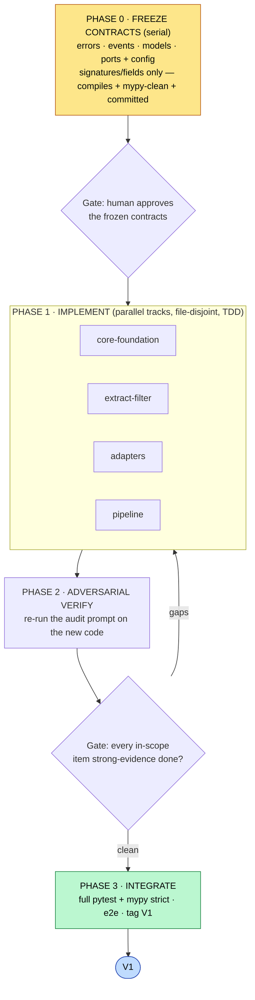

# mailflow V1 — Build Plan

**Date:** 2026-06-29 · **Derived from:** `features.md` (locked scope) + `v1-readiness-report.md` (evidence)
**Target:** drive the existing branch to a shippable **V1**.

---

## Read this first (plain-English overview)

This is the **construction plan** for finishing mailflow to its first release. The *report card*
(`v1-readiness-report.md`) said what's missing; the *roadmap* (`features.md`) said what V1 includes
after our scope decisions. This document says **how we build it** — in what order, who (which agent
track) owns what, and how we prove each piece is done.

**The locked V1 in one sentence:** a **Gmail-only**, **single-tenant** library that **polls** Gmail
for new mail (with Gmail's push used only to *wake* the poller sooner), cleans each email to plain
text, and hands a clean, de-duplicatable event to the consuming app.

**The golden rule of this plan:** **freeze the contracts first, then build in parallel.** The
"contracts" are the fixed shapes (method signatures, model fields, error types) that every other
piece depends on. If we let parallel work invent those shapes independently, the pieces won't fit.
So Phase 0 locks them down — serially — before anyone fans out.

---

## How the build runs (the harness)

### Guardrails (every task obeys these — from `CLAUDE.md`)

1. **TDD, one behavior per cycle:** write a failing test → confirm it fails *for the stated reason*
   → minimal implementation → green → `mypy --strict` clean → commit.
2. **File-disjoint ownership:** each track edits only its own files (table below). Cross-track needs
   are flagged, not patched.
3. **Bisectability:** every commit leaves the whole tree importable and `mypy`-clean. If module A
   imports B, commit B first.
4. **Evidence or it's not done:** a task is "done" only when its test passes and a verifier can
   quote the proof. No green test ⇒ not done.
5. **Use the venv:** `/Users/iamanam/projects/techjays/poc/mailflow/.venv/bin/python -m pytest` and
   `… -m mypy`.

### Ownership tracks

| Track | Owns (files) |
|---|---|
| **core-foundation** | `core/{errors,models,identity,events,ports,filtering,observability}.py` |
| **extract-filter** | `extract/`, `filters/` |
| **adapters** | `adapters/` (gmail, graph), `stores/`, `providers/` (in-memory), `emit/` |
| **pipeline** | `core/pipeline.py`, `config/`, `registry.py`, `builder.py`, `__init__.py` |
| **fixtures/docs** | `tests/fixtures/`, golden + e2e tests, `README.md`, user-facing docs |

---

## PHASE 0 — Freeze the contracts (serial; the keystone)

Goal: add the **shapes only** (no behavior) for every in-scope contract, compiling + `mypy`-clean +
committed, so Phase 1 can build against stable signatures. Each row is a small, test-backed commit.

| Item | File | What to add (signature/field only) | Notes |
|---|---|---|---|
| **A2** error taxonomy | `core/errors.py` | `class AuthError(MailflowError)`, `class PermanentError(MailflowError)`, `class TransientError(MailflowError)` (joins existing `ExtractionError`/`OversizedMessageError`/`ConfigError`). | Provider errors (`GraphError`/Gmail errors) re-parented so they subclass the right one. **Keystone — commit first.** |
| **A4** idempotency_key | `core/events.py` | Add `idempotency_key: str = ""` field to `EmailEvent`; bump `SCHEMA_VERSION` `"1.0" → "1.1"` (adding an optional field is a minor bump, per the file's own docstring). | Derivation already exists in `identity.py`; this only surfaces it on the wire. |
| **A5** WebhookVerifier port | `core/ports.py` | New `@runtime_checkable class WebhookVerifier(Protocol)` returning an **identity-only** result (verified subscription/mailbox identity, no payload trust). | Gmail OIDC-JWT impl lands in Phase 1. |
| **A6** ContentCleaner port | `core/ports.py` | New `@runtime_checkable class ContentCleaner(Protocol)` (`clean(CleanEmail) -> CleanEmail` shape). | Thin default impl lands in Phase 1. |
| **A7** thread_key | `core/models.py` | Add `thread_key: str = ""` (or `str | None`) field to `CleanEmail`. | Gmail `threadId` mapping lands in Phase 1. |
| **A8** rotation persistence | `core/ports.py` | Extend `SecretProvider` (or the OAuth token provider seam) with an **on-refresh persistence callback** signature. **Do not** add tenant/DWD params (out of V1). | Single-tenant keeps this minimal. |
| **A10** overrides seam | `builder.py`, `__init__.py`/facade | Accept an `overrides=` mapping param (shape only); declare `as_filter`/`as_cleaner` decorator names. | Wiring/behavior in Phase 1. |
| **A11** version + stability | `config/schema.py`, `core/ports.py` | Add a `version` field to `MailflowConfig`; add provisional/stable markers to ports; add the **sync-only** policy declaration. | Makes a future async family additive, not breaking. |

**Phase 0 exit gate (human):** review the frozen surface and resolve any last contract ambiguity
(surfaced as a **CONTRACT DECISION**) before fan-out. Once approved, the signatures are frozen.

---

## PHASE 1 — Implement (parallel tracks, TDD)

> **Sequencing rule:** **A2 routing/typed-raise lands before B3 and B4**, because both depend on the
> taxonomy. Everything else inside a track is independent.

### Track: core-foundation
- **A2 base** *(already in Phase 0)* — plus any shared classification helper used by adapters/pipeline.
- **A11 markers** — apply provisional/stable annotations; write the sync-only declaration.
- **Observability (light)** — basic structured logs / run-report counters. *(PII redaction deferred
  — do **not** build scrubbing now; just avoid logging full bodies by default.)*

### Track: extract-filter
- **A6 default cleaner** — thin HTML→text `ContentCleaner` impl. TDD: HTML-in → readable-text-out;
  gentle by default (no aggressive stripping).
- **B5 HTML→text parity** — shared converter util; ensure an **HTML-only** message yields non-empty
  `body_text` (this is what makes the plain-text UI usable). TDD: HTML-only fixture → `body_text` populated.
- **A7 Gmail thread_key** — map Gmail `threadId` onto `CleanEmail.thread_key`; subject-normalized
  fallback helper. TDD: Gmail message → `thread_key == threadId`; no-thread message → normalized-subject fallback.

### Track: adapters
- **A2 typed-raise** — at the Gmail provider/client boundary, raise `AuthError` (401),
  `PermanentError` (403/404/410/decode), `TransientError` (429/5xx/network).
- **A5 Gmail OIDC-JWT** — verify the Pub/Sub push token (signature via JWKS, audience, issuer);
  return identity only. TDD: valid token → verified identity; tampered/foreign token → rejected.
- **A8 rotation persistence** — when the OAuth refresh token rotates, persist it via the Phase-0
  callback. TDD: simulated rotation → new token saved → next run uses it.
- **B4 backoff + storm containment** — retry 5xx; exponential backoff + jitter honoring `Retry-After`;
  a bounded concurrency cap; **contain an exhausted-retry storm so it can't abort the run.** TDD:
  429-storm fixture → run survives, offending record handled, others continue.
- **B2 fetch-stage record isolation** — wrap the fetch iteration so a single malformed record is
  DLQ'd individually and the stream continues. TDD: one bad record among good ones → bad one DLQ'd,
  rest emitted.
- **B3 permanent at boundary** — ensure 404/410/decode raise `PermanentError` (pairs with pipeline routing).

### Track: pipeline
- **A2 routing** — replace the bare `except Exception` with type-based routing: `PermanentError` →
  DLQ-no-retry; `AuthError` (401) → refresh-once → retry; `TransientError` → bounded retry/backoff.
  TDD: each error type → its disposition; DLQ counted exactly once (`add_dead_letter` + paired trace).
- **A4 thread idempotency_key** — populate `EmailEvent.idempotency_key` from `identity.py` on emit.
  TDD: emitted event carries the `(tenant, mailbox, provider_message_id)` key.
- **B3 routing** — 404/410/decode → DLQ-no-retry (depends on A2 routing + adapters' typed-raise).
- **B1 size guard fail-closed** — unknown/omitted size ⇒ treat as over-limit ⇒ DLQ **before**
  download. TDD: size-unknown message → DLQ, never fetched.
- **A6 wire the cleaner** — run `ContentCleaner` as a real pipeline stage (not just a post-emit hook).
- **A10 overrides + decorators** — implement the `overrides=` injection and `as_filter`/`as_cleaner`
  sugar end-to-end. TDD: a component passed via `overrides=` is actually used.
- **A11 config version** — validate/echo the new config `version` field; fail-fast on mismatch.

### Track: fixtures/docs
- **A4 docs fix** — correct `getting-started.md` and `showcase.md`: remove the **exactly-once** claim,
  document **at-least-once** + how to use `idempotency_key`.
- **A12 conformance test** — add the dedicated StreamRef-granularity test (structure already correct).
- **A11 sync-only note** — document the synchronous-only guarantee in the README.

---

## PHASE 2 — Adversarial verification

Re-run the **same V1 audit prompt** that produced `v1-readiness-report.md`, now against the new code:
- One verifier per in-scope item; each must quote `file:line` proof that the behavior exists **and**
  is tested. No proof ⇒ status `missing` ⇒ loop back to Phase 1 for that item.
- Spot-check the guardrails: every commit `mypy`-clean, tree importable, DLQ counted once.

---

## PHASE 3 — Integration & Definition of Done

**Definition of Done for V1:**
- ✅ Full suite green: `… -m pytest` (all of e2e + reliability + new unit tests).
- ✅ `… -m mypy` strict clean on the whole tree.
- ✅ Every **in-scope** item (A2, A4, A5-Gmail, A6, A7, A8-reduced, A10, A11, B1, B2, B3, B4, B5)
  verified strong-evidence done; A3/A12/B6/D1 confirmed still green.
- ✅ A live (or recorded) Gmail run: push wakes → poll from cursor → clean → emit event **with**
  `idempotency_key`; a forged push is rejected; an oversized/unknown message is DLQ'd pre-download;
  a 429-storm does not abort the run.
- ✅ Docs say **at-least-once** (no exactly-once claims anywhere).

**Explicitly NOT required for V1 (deferred):** Outlook live (A1 rewire, C1, C2), GDPR erase/encrypt
(A9), PII redaction, multi-tenant, multi-worker concurrency, strict ordering, HTML sanitizer.

---

## Appendix — in-scope item → owner → primary files

| Item | Owner track | Primary file(s) |
|---|---|---|
| A2 taxonomy + routing | core-foundation → pipeline + adapters | `core/errors.py`, `core/pipeline.py`, `adapters/` |
| A4 idempotency_key | core-foundation → pipeline → docs | `core/events.py`, `core/pipeline.py`, docs |
| A5 (Gmail) verifier | core-foundation → adapters | `core/ports.py`, `adapters/gmail/` |
| A6 cleaner | core-foundation → extract-filter → pipeline | `core/ports.py`, `extract/`, `core/pipeline.py` |
| A7 thread_key | core-foundation → extract-filter | `core/models.py`, `extract/` |
| A8 rotation persistence | core-foundation → adapters | `core/ports.py`, `adapters/gmail/` |
| A10 overrides/decorators | pipeline | `builder.py`, `__init__.py` |
| A11 version/stability/sync | core-foundation + pipeline + docs | `core/ports.py`, `config/schema.py`, `README.md` |
| B1 size fail-closed | pipeline | `core/pipeline.py` |
| B2 DLQ isolation | adapters + pipeline | `adapters/`, `core/pipeline.py` |
| B3 permanent classify | adapters + pipeline | `adapters/`, `core/pipeline.py` |
| B4 backoff/storm | adapters | `adapters/*/client.py`, `adapters/` |
| B5 HTML→text parity | extract-filter | `extract/` |

---
*Plan derived from the 2026-06-29 locked scope. Source of truth for scope: `features.md`. Source of
truth for evidence: `v1-readiness-report.md`.*
