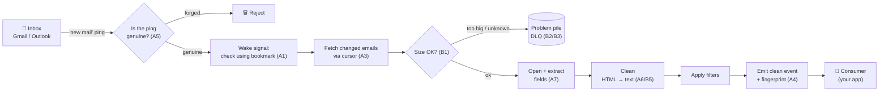
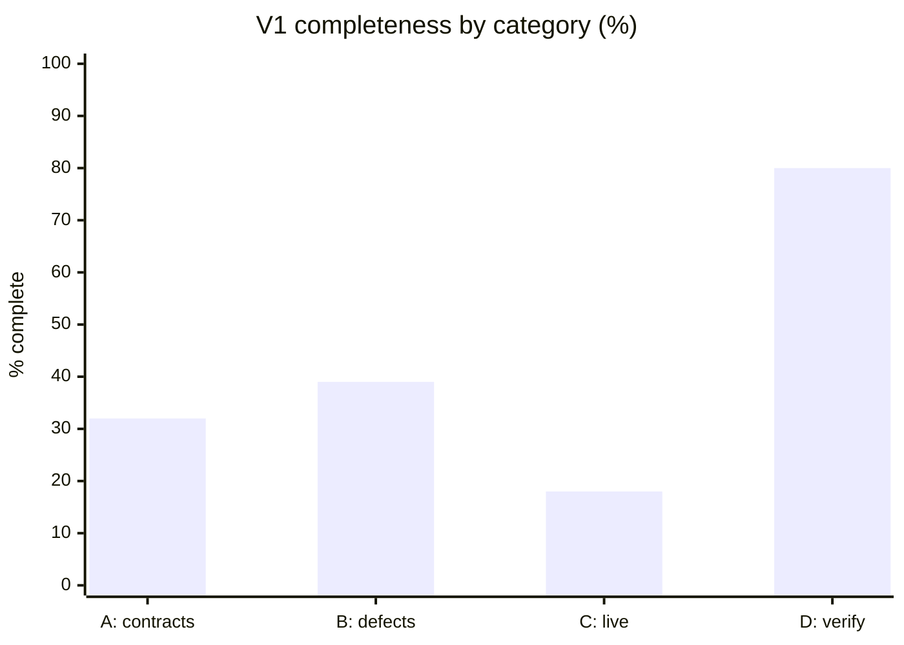
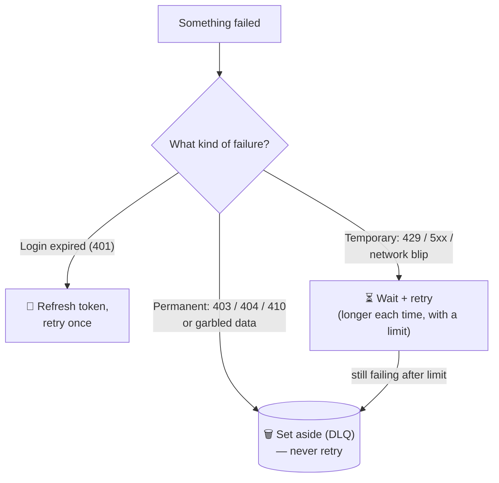
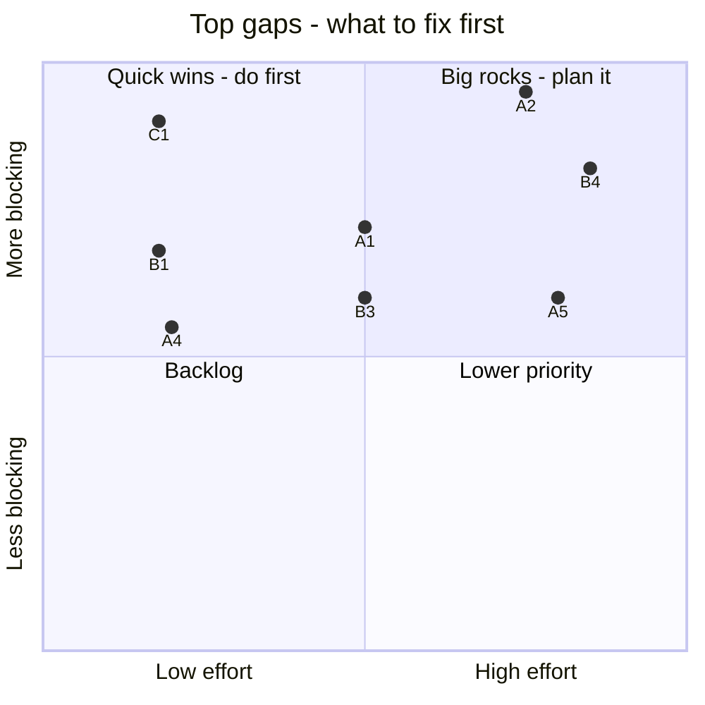
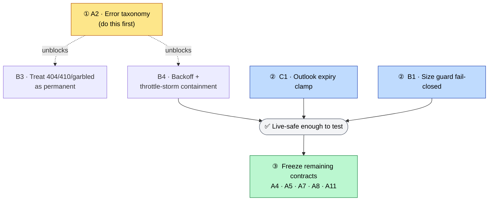

# mailflow — V1 Readiness Report

**Branch:** `feature/library` @ `8b0cc4b` · **Date:** 2026-06-29 · **Scope:** P0 (V1) tier of `features.md`

---

## Read this first (plain-English overview)

**What is this document?**
It's a **report card**. It checks how close the mailflow project is to being ready for its first
official release ("V1"), and it grades each must-have item with hard evidence from the actual code.

**What is mailflow?** (one-paragraph recap)
mailflow is a reusable software component — an **automated mailroom**. It watches an email inbox
(Gmail or Microsoft Outlook), and whenever new mail arrives, it fetches the email, opens it, pulls
out the useful parts (sender, subject, text, attachments), and hands a clean, structured summary to
whatever program is using it. For the full glossary of terms (DLQ, cursor, idempotency, webhook,
port, etc.), see the companion file **`features.md`** — that document defines the vocabulary and
this one grades the work. **A naming note:** Microsoft's email API is called **"Microsoft Graph"**,
so wherever you see **"Graph"** below (including in the code quotes) it means **Outlook**. Items
that apply to only one provider are tagged **(Outlook)** or **(Gmail)**; untagged items apply to
both. (For a side-by-side of how the two providers differ, see the "Gmail vs Outlook" table in
`features.md`.)

Here is the whole mailroom at a glance — the path every email takes. Each step in this picture maps
to one or more items graded later in this report:

**The headline:** the project is **not ready** for V1 yet — about **a third** of the must-have work
is done. Importantly, the parts that are missing are the *promises* — the contracts that, once
published, can't be changed without breaking everyone who builds on them. Shipping V1 without them
would force painful rewrites on users later. (Details below.)

### The 30-second version

- ✅ **What works:** mailflow can already be used today as a **Gmail "polling" library** — it
  periodically checks Gmail, cleans the emails, and lets you plug in your own filters. This is real
  and backed by passing tests.
- ❌ **What's missing:** the **frozen-forever promises** (how errors are typed, how "new mail" pings
  are proven genuine, how duplicates are flagged, etc.) are mostly absent or
  wrong. And the **live Microsoft Outlook path is broken out of the box.**
- 🛠️ **Effort to finish:** roughly **30–40 developer-days** (about 6–8 focused weeks for one
  engineer).
- ⏸️ **Consciously out of V1 (scope decisions, 2026-06-29):** see the V1 Scope box below — Outlook
  live support, GDPR erasure (A9), and PII redaction are all deferred.

### V1 Scope — LOCKED (2026-06-29)

Eleven product/scope decisions narrowed V1 to **Gmail-only, single-tenant, poll-authoritative with
Gmail push wired as a wake-trigger.** The full decision log lives in `features.md`. Here's what it
means for the items graded below:

| Bucket | Items |
|---|---|
| **Build for V1** | A2 · A4 · A6 · A7 · A10 · A11 · B1 · B2 · B3 · B4 · B5 |
| **Reduced for V1** | A5 → *Gmail OIDC-JWT only* · A8 → *token-rotation persistence only* |
| **Already done** | A3 (Gmail) · A12 · B6 · D1 (Gmail) |
| **Deferred — out of V1** | A1 (Outlook rewire — Gmail already complies) · C1 · C2 (Outlook live) · A9 (GDPR) · PII redaction |

> **Reading the grades vs. the scope:** the percentages and the **NO-GO** verdict below were computed
> against the *original* P0 set (all of A1–A12, B1–B6, C1–C2, D1) and are kept as the evidence
> snapshot. Because the deferred items (A1, C1, C2, A9) were among the *least-finished*, the true
> **in-scope** completeness is meaningfully higher than the 35% headline. Revised effort for the
> locked scope: **~18–26 dev-days (≈4–5 weeks for one engineer).**

### How to read the grades

- **GO / NO-GO** — the overall thumbs-up or thumbs-down on releasing V1.
- **Status icons:** ✅ Done · 🟡 Partial (started but incomplete or wrong) · ❌ Missing.
- **% complete** — rough fraction of that item that's finished.
- **Effort** — a t-shirt size for remaining work: **S** ≈ 1–2 days, **M** ≈ 3–5 days,
  **L** ≈ 5–8 days.
- **The four categories (A/B/C/D):**
  - **A — Freeze-now contracts:** promises that *must* be locked before V1 because changing them
    later breaks users. (The most important category.)
  - **B — Correctness defects:** existing bugs / risky behaviors in the code.
  - **C — Live blockers:** things that stop it working against the *real* email services right now.
  - **D — Verification gate:** proof that the design genuinely works with more than one provider.

---

## Verdict

| | |
|---|---|
| **GO / NO-GO** | **NO-GO** |
| **Overall V1 completeness** | **35%** (after dropping A9 from scope) |
| **Integration ease** | **5/10** |
| **Effort to V1** | ~30-40 dev-days for the **original P0 set** (locked-scope effort is **~18-26** — see the "V1 Scope — LOCKED" box); roughly 6-8 focused dev-weeks for one engineer. |

> **In plain English:** This is a "not yet" — and the reason is the *promises*, not the plumbing.
> Category A (the freeze-now contracts) is the surface other teams build against; once published it
> can't change without breaking them. **5 of its 11 in-scope items are entirely missing** (typed
> error classes, the "is this ping genuine?" check, the conversation-thread ID, the upgraded
> credential-handler, and the sync/stability/versioning policy — a 6th, A9 data-erasure/encryption,
> has been dropped from V1 scope), and
> **5 more are present-but-wrong** — including the core "what we send to consumers" contract itself
> (no duplicate-detection fingerprint on the outgoing event, and the docs actively *promise
> exactly-once delivery* when the system really only does *at-least-once*). Only 1 item (A12) is
> fully done.
>
> On top of that, the **live Outlook path is blocked**: it asks for a subscription that lasts longer
> than Outlook allows (so Outlook rejects it), it fetches mail by the ID inside the ping instead of
> re-deriving from its bookmark, and a "slow down" flood from the server crashes the entire run.
> Two more bugs are message-handling hazards: an unknown email size slips past the size limit, and a
> "message not found" error is silently skipped instead of being set aside. Gmail (D1) **is** a
> genuinely working, tested second provider — but a working provider sitting on top of unfinished
> promises is not a V1.

## How this was produced (evidence-based, adversarially verified)

*In other words: this report wasn't one person's opinion. It was produced by many independent AI
auditors who each had to back every claim with an exact quote from the code, then a second wave of
skeptics double-checked every one of those quotes.*

- **5 independent auditors** ran the V1 checklist against the live codebase, each starting from a
  different part of the code. Every status claim had to carry an exact quoted `file:line` snippet as
  proof — no proof meant the item was marked `missing`.
- **21 skeptical verifiers** (one per item) independently re-opened every cited reference, confirmed
  the quote matched the real file word-for-word, and gave their own verdict. **The verifiers' word
  overrides the original auditors'.**
- Scale: **27 agents**, **345 tool calls**, ~100 references re-checked. All 21 items came back with
  **strong evidence**; 2 inaccurate auditor quotes were caught and corrected.

## Category rollup

*A scoreboard by category. "Complete" is the rough percentage of that category that's finished.*

| Category | ✅ Done | 🟡 Partial | ❌ Missing | Complete |
|---|---|---|---|---|
| A — freeze-now contracts (11 in scope; A9 deferred) | 1 | 5 | 5 | 32% |
| B — correctness defects (B1-B6) | 1 | 4 | 1 | 39% |
| C — live blockers (C1-C2) | 0 | 2 | 0 | 18% |
| D — verification gate (D1) | 1 | 0 | 0 | 80% |

The same scoreboard as a picture — the further left the bar, the more work remains. Note that the
two weakest areas (A and C) are exactly the ones that block a V1 release:

## Item-by-item status

*Each row is one must-have. "What's missing" is trimmed here; the full plain-English explanation and
the code evidence for each are in the next section.*

| ID | Item | Status | % | Effort | Verified | What's missing |
|---|---|---|---:|---|---|---|
| A1 | Notifications are wake-signals only **(Gmail ✔; Outlook rewire deferred)** | 🟡 Partial | 50 | M (~3-5d) | ✔ confirmed (6 refs) | Graph default path must re-derive changed messages from the stored deltaLink instead of GETting the push-su... |
| A2 | Typed error taxonomy (Auth/Permanent/Transient) | ❌ Missing | 10 | L (~5-8d) | ✔ confirmed (4 refs) | Entire Auth/Permanent/Transient hierarchy; type-based routing (Permanent->DLQ-no-retry, 401->refresh-once, ... |
| A3 | Cursor contract (durable resume token) | 🟡 Partial | 60 | M (~3-5d) | ✔ confirmed (9 refs) | Notification path must persist a real resumable deltaLink; self._order is in-memory and resets to 0 on rest... |
| A4 | idempotency_key on EmailEvent + at-least-once docs | 🟡 Partial | 15 | S (~1-2d) | ~ partial (5 refs) | Surface idempotency_key field on EmailEvent; document at-least-once; remove exactly-once claims. |
| A5 | WebhookVerifier port | 🟡 Partial | 22 | L (~5-8d) | ✔ confirmed (5 refs) | Port abstraction; Graph validationToken handshake; identity-only return shape; entire Gmail OIDC-JWT (signa... |
| A6 | ContentCleaner port (thin default) | ❌ Missing | 15 | M (~3-5d) | ~ partial (6 refs) | ContentCleaner port; default thin HTML->text cleaner; aggressive-stripping opt-in. |
| A7 | Provider-native thread key on CleanEmail | ❌ Missing | 10 | M (~3-5d) | ✔ confirmed (4 refs) | thread_key field on CleanEmail; map Gmail threadId / Graph conversationId; subject-normalized fallback. |
| A8 | Widened SecretProvider | ❌ Missing | 10 | L (~5-8d) | ✔ confirmed (5 refs) | Tenant-scoped get; authorized-transport/DWD factory; refresh-token rotation persistence callback. |
| A9 | Store erasure + encryption-context | ⏸️ Deferred (out of V1 scope) | — | — | ✔ confirmed (4 refs) | **Dropped from V1 (decision 2026-06-29).** Not counted in totals. See A9 note below. |
| A10 | Builder overrides= + as_filter/as_cleaner sugar | 🟡 Partial | 55 | M (~3-5d) | ~ partial (7 refs) | Generic overrides= seam to inject arbitrary component instances; formal named decorators. |
| A11 | Sync-only declaration + port-stability/config-version policy | ❌ Missing | 10 | S (~1-2d) | ✔ confirmed (3 refs) | Explicit sync-only policy declaration; provisional/stable port markers; config version field. |
| A12 | Provider-defined StreamRef granularity | ✅ Done | 90 | S (~1-2d) | ✔ confirmed (6 refs) | Only a dedicated test proving the seam; structural requirement met. |
| B1 | Size guard fails CLOSED on unknown size | 🟡 Partial | 15 | S (~1-2d) | ~ partial (4 refs) | Fail-closed on unknown/omitted size (DLQ without download); Content-Length/probe instead of estimate fallback. |
| B2 | Per-message DLQ isolation | 🟡 Partial | 60 | M (~3-5d) | ~ partial (4 refs) | Fetch-stage per-record isolation (malformed page/delta record -> DLQ that record, continue); multi-message ... |
| B3 | 404/410 & invalid-base64 classified Permanent | 🟡 Partial | 15 | M (~3-5d) | ✔ confirmed (4 refs) | Classify 404/410/decode failures as Permanent -> immediate DLQ; depends on A2 taxonomy. |
| B4 | Retry-After-aware bounded backoff + concurrency cap | 🟡 Partial | 40 | L (~5-8d) | ✔ confirmed (3 refs) | 5xx retry; exponential backoff+jitter; concurrency/rate cap; storm containment so exhausted retries don't a... |
| B5 | Cross-provider body_text parity | ❌ Missing | 20 | M (~3-5d) | ✔ confirmed (3 refs) | Shared HTML->text converter applied in both extractors so body_text is populated identically. |
| B6 | Page-atomic cursor commit (no $top=1) | ✅ Done | 82 | S (~1-2d) | ✔ confirmed (6 refs) | Minor: notification path synthetic per-message cursor isn't a real resume token (overlaps A3). |
| C1 | Graph subscription expiry <=4230 min **(Outlook — ⏸️ deferred)** | 🟡 Partial | 15 | S (~1-2d) | ✔ confirmed (2 refs) | Lower default to <=4230 and add a validator/clamp for message-resource subscriptions. |
| C2 | Graph size-probe verified **(Outlook — ⏸️ deferred)** | 🟡 Partial | 20 | M (~3-5d) | ✔ confirmed (2 refs) | Extended-property size probe on the delta/select call (verified) OR a streaming download cap before full fe... |
| D1 | Second-provider conformance proof **(Gmail)** | ✅ Done | 80 | M (~3-5d) | ✔ confirmed (9 refs) | OIDC-JWT push verification (shared with A5); restore Graph provider tests. |

## Evidence detail (verified proof per item)

*For each item below: an **In plain English** line explains what it is and why it matters, then
**Proof** gives the exact code evidence, **Missing** lists what's left, and **Effort** estimates the
remaining work.*

### A1 · Notifications are wake-signals only — 🟡 Partial (50%) · **(V1: satisfied for Gmail; Outlook rewire deferred)**

> **V1 scope note:** The Gmail path already obeys this rule (it re-derives from the `historyId`
> cursor), so for a **Gmail-only V1** this is effectively satisfied. The fix described below is the
> *Outlook* rewire, which is **deferred** to the Outlook fast-follow.

**In plain English:** The golden rule is that a "you have new mail" ping should only mean *"go check
your inbox using your bookmark"* — never *"fetch exactly the email named in this ping."* Pings can be
forged or arrive out of order, so trusting the ID inside one is unsafe. Gmail follows this rule;
Outlook (Graph) currently breaks it by fetching the exact ID from the ping.

**Proof:** Gmail conforms: adapters/gmail/provider.py:51,56 re-derives via client.history_message_ids from durable cursor.value. Graph violates: adapters/graph/provider.py:72-82 fetch() iterates pending notes -> _fetch_message (127-129) calls client.get_message(note.user_id, note.message_id), a direct GET by push-supplied id; module docstring lines 1-4 confirm 'fetch() does the actual Graph GET per pending pointer'. delta_sweep (line 100) is fallback-only.

**Missing:** Graph default path must re-derive changed messages from the stored deltaLink instead of GETting the push-supplied message_id; treat notification purely as a wake signal.

**Effort:** M (~3-5d) — Rewire Graph fetch() to run delta on wake; collapse push path into sweep trigger.

### A2 · Typed error taxonomy (Auth/Permanent/Transient) — ❌ Missing (10%)

**In plain English:** The system needs to sort failures into three clear types so it can react
correctly — *Auth* (re-login), *Permanent* (give up, set aside), *Transient* (wait and retry).
Right now there's no such classification at all: every failure is treated the same and just retried
a fixed number of times. This is foundational — two other fixes (B3 and B4) depend on it existing.

Here is the sorting logic that *should* exist — each failure type gets a different reaction:

**Proof:** Repo-wide grep for AuthError/PermanentError/TransientError/refresh_once/backoff returns ZERO. pipeline._process has one bare `except Exception` routing solely by attempt count (retry to max_attempts then DLQ). GraphError carries status_code but does not subclass MailflowError and is never inspected for routing.

**Missing:** Entire Auth/Permanent/Transient hierarchy; type-based routing (Permanent->DLQ-no-retry, 401->refresh-once, 403->permanent). Foundational for B3/B4.

**Effort:** L (~5-8d) — New exception tree + classification at provider boundaries + pipeline routing rewrite.

### A3 · Cursor contract (durable resume token) — 🟡 Partial (60%)

**In plain English:** The "bookmark" that remembers where reading stopped must survive a crash and
always move forward. The polling paths get this right. But the *push-notification* path saves a fake,
made-up bookmark that can't actually resume — so after a restart it's forced to re-scan everything
from scratch.

**Proof:** Correct: Gmail cursor=historyId, Graph sweep cursor=@odata.deltaLink, monotonic via Cursor.__lt__ + commit_if_ahead (stores/memory.py:24-30), advances only on terminal disposition (pipeline.py:88-90). Defect: Graph notification path (_to_raw provider.py:151-162) commits synthetic f"{stream.key}#{self._order}", persisted at pipeline.py:90; sweep() (95-99) only treats 'http'-prefixed values as real delta tokens, so restart forces full resync.

**Missing:** Notification path must persist a real resumable deltaLink; self._order is in-memory and resets to 0 on restart (latent commit_if_ahead reject).

**Effort:** M (~3-5d) — Tied to A1 rewire; emit real deltaLink on the wake path.

### A4 · idempotency_key on EmailEvent + at-least-once docs — 🟡 Partial (15%)

**In plain English:** Every email handed to a consumer should carry a unique fingerprint so the
consumer can spot duplicates (because delivery is *at-least-once* — the same email can occasionally
arrive twice). The fingerprint is computed internally but **never put on the outgoing event**, so
consumers can't see it. Worse, the docs currently *promise exactly-once delivery* — the opposite of
the truth — which is actively misleading.

**Proof:** EmailEvent has only schema_version/tenant/ordering_key/email (events.py:17-21) - no idempotency_key on the wire. Derivation with exact required tuple exists (identity.py:15-18) but used only internally (pipeline.py:94). Docs assert exactly-once (getting-started.md:182, showcase.md:396), the opposite of required at-least-once.

**Missing:** Surface idempotency_key field on EmailEvent; document at-least-once; remove exactly-once claims.

**Effort:** S (~1-2d) — Add field + thread through emit; correct two docs.

### A5 · WebhookVerifier port — 🟡 Partial (22%) · **(V1: reduced to Gmail OIDC-JWT only)**

> **V1 scope note:** Push is wired as a wake-trigger via Gmail Pub/Sub, so V1 needs **only the Gmail
> OIDC-JWT verification** (signature/audience/issuer). The Graph `validationToken` handshake is
> **deferred** with the rest of the Outlook work.

**In plain English:** When a "you have new mail" ping arrives over the internet, you need to prove
it's genuinely from Gmail/Outlook and not a forgery. There's no standard component for this yet.
Outlook has a partial shared-secret check but skips the required handshake; Gmail has **no
verification at all** — it just trusts whatever arrives. That means push ingestion is currently
unauthenticated.

**Proof:** No WebhookVerifier port (grep empty); core/ports.py defines 11 ports, none for webhook verification. Only real credit: Graph clientState constant-time compare (notifications.py:92-93 hmac.compare_digest). Validation event is SKIPPED (subscriptionId=='NA' -> continue, 90-91), not an echo-back handshake. Gmail has NO OIDC-JWT verification (parse_pubsub_message lines 30-39 only base64/json-decodes).

**Missing:** Port abstraction; Graph validationToken handshake; identity-only return shape; entire Gmail OIDC-JWT (signature/audience/issuer) path.

**Effort:** L (~5-8d) — New port + two provider impls + JWKS verification.

### A6 · ContentCleaner port (thin default) — ❌ Missing (15%)

**In plain English:** There should be a standard, swappable "cleaning" step that turns an email's
HTML into readable text — with a *gentle* default and aggressive stripping only if you opt in. That
swappable step doesn't exist; there's only a generic catch-all hook that runs after the fact, not a
proper cleaning stage.

**Proof:** grep for contentcleaner/ContentCleaner across src/ and tests/ returns nothing (exit 1). No port, no thin HTML->text default, no aggressive opt-in. Only substrate: generic user clean_fn as a post-emit stage (facade.py:215-216). Per-message DLQ isolation is incidental (emit at pipeline.py:144 inside try/except 117/152).

**Missing:** ContentCleaner port; default thin HTML->text cleaner; aggressive-stripping opt-in.

**Effort:** M (~3-5d) — Define port, default impl, wire into pipeline as a real seam.

### A7 · Provider-native thread key on CleanEmail — ❌ Missing (10%)

**In plain English:** Emails in a back-and-forth conversation should carry the ID that groups them
(Gmail `threadId` / Outlook `conversationId`) so a reply can be linked to the original. That ID is
never carried onto the clean email — so consumers can't reliably group conversations.

**Proof:** CleanEmail has no thread_key/conversation_id field (models.py:143-189). Graph client fetches conversationId (client.py:16) but extractor ce_kwargs never maps it (extractor.py:71-103). Only thread key is at persistence (sqlite_store._thread_key lines 41-47) from references[0] else canonical_id - not provider-native, not subject-normalized. No normalization logic anywhere.

**Missing:** thread_key field on CleanEmail; map Gmail threadId / Graph conversationId; subject-normalized fallback.

**Effort:** M (~3-5d) — Model field + both extractor mappings + normalization helper.

### A8 · Widened SecretProvider — ❌ Missing (10%) · **(V1: reduced to token-rotation persistence)**

> **V1 scope note:** Single-tenant + delegated OAuth means V1 does **not** need tenant-scoping or
> domain-wide-delegation. The one part that stays in V1 is the **refresh-token rotation
> persistence** — a refreshed token that isn't saved bricks the next run, regardless of tenancy.

**In plain English:** The credential-handler (which supplies login tokens) needs to support multiple
customers and mailboxes, and crucially must **save** a refreshed login token. Today it's a bare
"give me one secret by name" with no customer scoping and no way to persist a rotated token — which
means a renewed token is forgotten and the *next* run silently breaks.

**Proof:** SecretProvider Protocol (ports.py:77-79) is exactly `def get(self, ref: str) -> str` - no tenant param, no per-mailbox authorized-transport factory, no rotation callback. EnvSecretProvider mirrors it. Gmail uses static oauth_refresh_token_ref (config.py:28); OAuthTokenProvider refreshes in-memory (live.py:54-55) with no persist hook. grep for impersonation/with_subject/DWD/rotation/on_refresh: zero.

**Missing:** Tenant-scoped get; authorized-transport/DWD factory; refresh-token rotation persistence callback.

**Effort:** L (~5-8d) — Protocol redesign + provider rewiring + rotation persistence path.

### A9 · Store erasure + encryption-context — ⏸️ Deferred (out of V1 scope)

> **Scope decision — 2026-06-29:** A9 is **dropped from V1** and is **not counted** in the
> completeness totals above. Rationale: A9 was only ever a *contract stub* request (empty
> `erase()` / `encryption_context` method shapes), and its whole reason for being P0 was to avoid a
> breaking change for *external teams that implement their own stores*. For this POC the team owns
> all store implementations, so those methods can be added later as a normal, non-breaking change —
> there is no third-party implementor to break. Real GDPR deletion tooling and KMS encryption were
> already deferred to P2 in `features.md`; this decision drops the P0 contract stub as well. The
> original finding is retained below for the record.

**In plain English:** Storage should ideally be able to **erase** a person's data (for privacy laws
like GDPR) and accept encryption information. None of the storage components can delete anything, and
none accept encryption context. *For V1 this is intentionally not required* — see the decision box
above.

**Proof:** BlobStore/CursorStore/DedupeStore expose no delete()/erase(); BlobStore.put_stream takes no encryption-context arg (core/ports.py, stores/memory.py). grep across ports/stores/persistence for delete/erase/encryption_context: zero matches.

**Missing (deferred, not required for V1):** erase()/delete() on all stores (GDPR); encryption-context param on BlobStore.put_stream and impls.

**Effort if/when picked up later:** L (~5-8d) — Signature additions across 3 ports + memory/sqlite/local_blob impls.

### A10 · Builder overrides= + as_filter/as_cleaner sugar — 🟡 Partial (55%)

**In plain English:** Consumers should be able to plug in their own custom pieces easily. Half of
this works — you can pass in filters and cleaners as simple functions. What's missing is a general
"swap in any component I give you" mechanism and the tidy named shortcuts (`as_filter` /
`as_cleaner`) for declaring them.

**Proof:** Filters inject without full wiring: connect(filters=[...]) accepts callables via FunctionFilter (facade.py:72-84, deterministic.py:151-162). Cleaners inject as callables too: connect(clean_fn=..., stages=[...]), Stage=Callable[[CleanEmail],...] (stages.py:19). Missing: generic overrides= mapping (absent in facade.connect and builder.build_from_config) and named as_filter/as_cleaner decorators (grep zero).

**Missing:** Generic overrides= seam to inject arbitrary component instances; formal named decorators.

**Effort:** M (~3-5d) — Add overrides mapping to facade/builder + decorator sugar.

### A11 · Sync-only declaration + port-stability/config-version policy — ❌ Missing (10%)

**In plain English:** V1 should state plainly that it runs synchronously (one thing at a time), mark
which internal "plugs" are stable vs experimental, and put a version number on its config. None of
these declarations exist. Without them, a future async upgrade would be a *breaking* change instead
of a clean addition.

**Proof:** grep for 'sync-only'/'synchronous only': nothing. No provisional/stable markers in ports.py (grep zero). MailflowConfig (schema.py:32-42) has no version field (grep -niw version in config/ zero). Only versioning is SCHEMA_VERSION='1.0' (events.py:14) for the wire event, not config/ports.

**Missing:** Explicit sync-only policy declaration; provisional/stable port markers; config version field.

**Effort:** S (~1-2d) — Docs/policy + config schema version field + port annotations.

### A12 · Provider-defined StreamRef granularity — ✅ Done (90%)

**In plain English:** Each provider should decide how it slices the inbox into "streams" to watch —
Gmail uses one whole-mailbox stream, Outlook goes per-folder — and the shared core shouldn't care
which. This is done correctly; the only thing left is a dedicated test to lock the behavior in.

**Proof:** StreamRef carries optional folder field leaving granularity provider-defined; Gmail sync_streams emits one mailbox-level stream (folder=None), Graph builds per-folder StreamRefs (provider _stream_for, subscriptions.folder_resource) driven by GraphConfig.folders. grep for $top/top=1 across src: zero (page trick absent).

**Missing:** Only a dedicated test proving the seam; structural requirement met.

**Effort:** S (~1-2d) — Add a conformance test; no code change needed.

### B1 · Size guard fails CLOSED on unknown size — 🟡 Partial (15%)

**In plain English:** When an email's size is unknown, the safe move is to treat it as *too big and
reject it* ("fail closed"). Today the guard does the opposite — an unknown size becomes 0, which
sails under the limit, so oversized/unknown emails slip through instead of being set aside.

**Proof:** Guard exists (pipeline.py:111) but uses `message_size(msg) or msg.size_bytes` - fallback-to-estimate, not fail-closed. If both are 0/falsy, size=0 and `0 > max_message_bytes` is False, bypassing the ceiling. No DLQ-without-download path, no Content-Length probe.

**Missing:** Fail-closed on unknown/omitted size (DLQ without download); Content-Length/probe instead of estimate fallback.

**Effort:** S (~1-2d) — Treat unknown size as over-limit; route to DLQ pre-download.

### B2 · Per-message DLQ isolation — 🟡 Partial (60%)

**In plain English:** One broken email must be set aside on its own and never crash the whole batch.
This works during *processing* but not during *fetching*: a single bad record while fetching aborts
the entire stream. So one malformed item can still take everything down.

**Proof:** Processing-stage isolation solid: pipeline._process (117-159) try/except DLQs at max_attempts (153-156), loop continues; test_poison_dead_lettered_at_max_attempts passes. But fetch stage has NO try/except (run_once 76-81, _run_stream 83-90); a fetch GraphError (provider.py:131-132) aborts the whole stream. Non-dict delta records silently dropped (client.py:90).

**Missing:** Fetch-stage per-record isolation (malformed page/delta record -> DLQ that record, continue); multi-message isolation test.

**Effort:** M (~3-5d) — Wrap fetch iteration; DLQ malformed records individually.

### B3 · 404/410 & invalid-base64 classified Permanent — 🟡 Partial (15%)

**In plain English:** "Email not found" (404), "email is gone" (410), and "garbled data" are
*permanent* failures — retrying them never helps, so they should be set aside immediately. Today
they're all treated as temporary and retried wastefully: 404 is silently skipped (never set aside),
410 is retried forever, and garbled data is retried too. This fix depends on A2 (the error
classification) existing first.

**Proof:** Single generic `except Exception` (pipeline.py:152-159), no permanent/transient split - all retried to max_attempts. Graph 404 (provider.py:127-140) returns None -> continue (79-80), never DLQ'd; 410 not handled (only !=404 checked) so re-raised+retried. Gmail invalid base64 (provider.py:66) raises binascii.Error caught generically and retried.

**Missing:** Classify 404/410/decode failures as Permanent -> immediate DLQ; depends on A2 taxonomy.

**Effort:** M (~3-5d) — After A2: map these to permanent and DLQ-no-retry.

### B4 · Retry-After-aware bounded backoff + concurrency cap — 🟡 Partial (40%)

**In plain English:** When the provider says "too many requests, slow down," a good client waits and
retries politely (waiting longer each time), and caps how many requests run at once. Today it
partially honors the "wait this long" header but doesn't retry server errors (5xx), has no
progressive waiting, and has no concurrency cap. Worst of all, a flood of "slow down" responses
escapes uncaught and **crashes the entire run.**

**Proof:** 429 Retry-After present + bounded by max_retries (graph/client.py:39-43, gmail/client.py:37-40) - only satisfied part. 5xx NOT retried (client.py:44 raises for all non-429 >=400). No exponential/jitter (grep zero). No concurrency/rate cap (grep semaphore/concurren/rate_limit zero). Throttle storm escapes uncaught: sweep() (provider.py:100) no try/except -> propagates through _run_stream (line 85).

**Missing:** 5xx retry; exponential backoff+jitter; concurrency/rate cap; storm containment so exhausted retries don't abort the run.

**Effort:** L (~5-8d) — Backoff policy + bounded inflight semaphore + run-loop containment.

### B5 · Cross-provider body_text parity — ❌ Missing (20%)

**In plain English:** An HTML-only email should still produce readable plain text — and the *same
way* for both providers. Today neither provider does this: an HTML-only message ends up with blank
plain text. There's no shared HTML→text converter anywhere.

**Proof:** No uniform HTML->text fallback. Graph _body (extractor.py:38-39) maps HTML to body_html, returns body_text="". MimeExtractor._walk_body (mime.py:134) fills body_text only from text/plain. HTML-only message yields empty body_text in both. No html2text/strip_tags/get_text/BeautifulSoup anywhere.

**Missing:** Shared HTML->text converter applied in both extractors so body_text is populated identically.

**Effort:** M (~3-5d) — Add converter util; call from both extractor body paths.

### B6 · Page-atomic cursor commit (no $top=1) — ✅ Done (82%)

**In plain English:** The bookmark should advance one *page* of emails at a time, safely, without
the wasteful trick of one network round-trip per single message. This is done correctly — a whole
page is fetched and one bookmark is saved for it, and duplicate-protection handles any replay. The
only loose end overlaps with A3 (the fake bookmark on the push path).

**Proof:** No $top=1 trick (grep zero). Graph delta_sweep (client.py:75-95) follows @odata.nextLink to completion, returns ONE deltaLink; every swept message carries that same value. Gmail shares one new_cursor across the history diff. dedupe (try_claim) absorbs intra-page replay. self._order increments per message but persisted VALUE is constant per page (pipeline.py:88-90), harmless for resume.

**Missing:** Minor: notification path synthetic per-message cursor isn't a real resume token (overlaps A3).

**Effort:** S (~1-2d) — Resolved alongside A3; otherwise compliant.

### C1 · Graph subscription expiry <=4230 min — 🟡 Partial (15%) · **(Outlook only — ⏸️ deferred to fast-follow)**

**In plain English:** Outlook limits how long a "watch this inbox" subscription can last (about 4230
minutes for mail). The code asks for ~8640 minutes (≈6 days), which is over the limit — so the real
Outlook service would reject every subscription request with an error. There's also no safety clamp
to keep the value in range.

**Proof:** config.py:38 default subscription_minutes=8640 (~6d) exceeds the 4230-min Outlook message-resource max; comment misleadingly cites the 10080-min cap. _expiration_iso (subscriptions.py:53-56) adds with no clamp, passed straight to create_subscription, so a real create would 400 for .../messages. No field_validator bounds subscription_minutes (config.py:41-53).

**Missing:** Lower default to <=4230 and add a validator/clamp for message-resource subscriptions.

**Effort:** S (~1-2d) — Change default + add field_validator clamp.

### C2 · Graph size-probe verified — 🟡 Partial (20%) · **(Outlook only — ⏸️ deferred to fast-follow)**

**In plain English:** We want to know an email's size *before* downloading it, so a giant one can be
rejected without wasting bandwidth. The current approach only estimates the size *after* already
downloading — no protection beforehand — and there's no test proving it works against real Outlook.

**Proof:** MESSAGE_SELECT (client.py:13-18) has NO size extended property (no singleValueExtendedProperties); only 'size' is attachment metadata (list_attachments line 70). message_size (provider.py:117-124) decodes already-fetched raw_bytes and approximates - post-download estimate, no protection before download. No test exercises it (grep zero).

**Missing:** Extended-property size probe on the delta/select call (verified) OR a streaming download cap before full fetch.

**Effort:** M (~3-5d) — Add singleValueExtendedProperties size select + verify; or streaming cap.

### D1 · Second-provider conformance proof — ✅ Done (80%) · **(Gmail is the reference provider)**

**In plain English:** To prove the design really is provider-agnostic, a *second* provider has to
work end-to-end. Gmail does — it's a real, tested provider built on the same shared parts, with 11
passing tests. The only gaps: Gmail's push-verification is still missing (overlaps A5), and the old
Outlook provider tests need restoring.

**Proof:** Gmail is a working, tested second provider: GmailProvider implements MailboxProvider (connect/sync_streams/fetch/message_size), cursor=historyId (provider.py:63), one mailbox stream (provider.py:46), reuses core MimeExtractor. Ran tests/test_gmail_e2e.py + tests/test_gmail_reliability.py => 11 passed. Gap: Gmail Pub/Sub OIDC-JWT push verification absent (overlaps A5); tests/providers/graph/ holds only stale .pyc (no tracked .py).

**Missing:** OIDC-JWT push verification (shared with A5); restore Graph provider tests.

**Effort:** M (~3-5d) — Verifier half overlaps A5; re-add Graph test files.

## Top gaps (ranked, most blocking first)

*If you only fix a few things, fix these — in this order. The most blocking come first.*

This map plots the worst gaps by **how hard they are to fix** (left = easy) against **how badly they
block V1** (top = worst). The top-left corner is where to start — high impact, low effort:

1. **A2 typed error taxonomy is missing entirely** — there are no Auth/Permanent/Transient classes;
   the pipeline only counts retry attempts. This is foundational — both B3 and B4 depend on it.
2. **C1 Graph subscription expiry is too long** (8640 min vs the 4230-min cap, with no clamp) — a
   real Outlook subscription request would be rejected, blocking live Outlook watching entirely.
3. **B4 throttle storm crashes the run** — when "slow down" retries are exhausted, the error
   propagates all the way up and aborts everything; plus there's no server-error retry, no
   progressive backoff, and no concurrency cap.
4. **A1 Graph fetches by the ping's message ID** instead of re-deriving from its durable bookmark —
   so notifications aren't truly "wake-signals only" on the default Outlook path.
5. **A4 no duplicate-detection fingerprint on the outgoing event**, and the docs claim exactly-once
   (the opposite of the real at-least-once) — a breaking wire-contract change if deferred past V1.
6. **A5 no way to verify a "new mail" ping is genuine** — Gmail has zero verification and Outlook
   has no handshake, so push ingestion is unauthenticated.
7. **B1 size guard fails open on unknown size** (size=0 sneaks past the limit) — oversized/unknown
   emails slip through instead of being safely rejected.
8. **B3 "not found / gone / garbled" not treated as permanent** — 404 is silently skipped, 410 is
   retried forever, garbled data is retried wastefully.
9. **A8 SecretProvider not upgraded** — no per-customer scoping, no domain-wide-delegation factory,
   and no way to save a rotated login token (so the next run can break).
10. **A7 no conversation-thread ID on the clean email** — Gmail `threadId` / Outlook
    `conversationId` are unmapped, with no subject-line fallback.
11. **B5 no shared HTML→text fallback** — HTML-only emails come out with blank plain text in both
    providers, breaking parity.

*(A9 store erasure/encryption was previously listed here but has been dropped from V1 scope — see the
A9 note above.)*

## Effort & sequencing

*Roughly how long the remaining work takes, and a sensible order to tackle it in.*

~30-40 dev-days (roughly 6-8 focused dev-weeks for one engineer; A9 dropped from scope removes ~5-6
days). Breakdown: the freeze-now contract work (A2, A5, A8 at L each ~5-6d, plus A1/A3/A6/A7/A10 at M
and A4/A11 at S) dominates at ~23-26
days; correctness defects (B1/S, B2/M, B3/M, B4/L, B5/M) add ~12-14 days but B3 reuses A2; live
blockers C1/S and C2/M add ~4 days; D1 is mostly done (its push-verification gap overlaps A5).

**Suggested order:** do **A2 first** (it unblocks B3 and B4), then **C1 + B4 + B1** for live safety,
then lock down the remaining contract freezes.

The same plan as a picture — colors mark the three phases, and dotted arrows show what each fix
unblocks:

## How easily can a user integrate today?

**Score: 5/10.** *Translation: usable for one narrow case today, with hard walls everywhere else.*

A consumer can adopt mailflow today for a **poll/pull-based Gmail integration**: the simple front
door (`connect` with `filters=`, `clean_fn=`, `stages=`) lets you inject your own filters and
cleaners as plain functions without wiring up every internal part (A10), and Gmail is a working,
tested provider (D1 — 11 tests pass). But anyone needing **production webhook ingestion, Microsoft
Outlook live watching, or strong delivery/security guarantees** will hit hard walls. The output
contract isn't final (no duplicate-detection fingerprint on the event, and docs wrongly promise
exactly-once), there's no way to verify incoming pings, no error classification to react to, and
Outlook live watching would be rejected at subscription time. **Treat it as a usable Gmail polling
library, not a finished multi-provider event platform.**

**What a consumer must do today (the workarounds):**

- Use Gmail in a poll loop and supply the OAuth refresh-token via the environment-variable secret
  provider (a single static value).
- **Build their own ping authentication** — there is no verifier; Gmail's signed-token check and
  Outlook's handshake are both absent.
- **Implement their own duplicate detection**, keyed off `(tenant, mailbox, provider_message_id)`,
  because the fingerprint isn't exposed on the emitted event.
- **Assume at-least-once delivery** despite the docs saying exactly-once, and design consumers to
  tolerate the occasional duplicate.
- **Avoid Outlook live subscriptions** until C1 (expiry clamp) and A1 (wake-only fetch) are fixed —
  or manually override the subscription length to ≤4230 minutes.
- **Wrap `provider.fetch()` themselves** to survive throttle storms (B4) and fetch-stage errors (B2)
  that currently abort the whole run.
- **Pre-filter oversized emails externally** — the size guard fails open on unknown size (B1).

**Friction points:**

- No duplicate-detection fingerprint on the output event; consumers must rebuild it themselves (A4).
- Docs assert exactly-once while the system is at-least-once — actively misleading (A4).
- No ping verification of any kind (A5) — unauthenticated push ingestion.
- No error classification (A2) — consumers can't tell auth vs permanent vs temporary failures apart.
- Outlook live watching broken out of the box: subscription too long (C1) and pings fetched by ID
  (A1).
- Throttle storms and fetch-stage errors propagate uncaught and abort the run (B4, B2).
- HTML-only emails produce blank plain text (B5) — inconsistent content across providers.
- No conversation-thread ID on the clean email (A7) for downstream grouping. *(Data-erasure/
  encryption hooks, A9, are intentionally out of V1 scope — see the A9 note.)*
- The general "swap in your own component" mechanism and named `as_filter`/`as_cleaner` shortcuts
  don't exist — only implicit function-passing (A10).

## Bottom line

- **Works today:** a poll/pull **Gmail** integration with injectable filters & cleaners (plain
  functions), backed by 11 passing tests. Gmail is a genuine, working second provider (D1 ✅),
  proving the swap-in-any-provider design is real.
- **Not yet V1:** the freeze-now **contract surface** (Category A) is only ~32% done — 5 of 11
  in-scope promises are entirely absent. Shipping V1 without them means breaking users later. Plus
  Outlook live watching is broken out of the box (C1) and several message-handling hazards remain
  (B1/B3/B4).
- **Recommended path:** land **A2 (error classification)** first — it unblocks B3/B4 — then
  **C1 + B4 + B1** for live safety, then freeze the remaining contracts (A4/A5/A7/A8/A11) before
  declaring V1.
- **Out of V1 scope (2026-06-29 decision):** A9 store erasure/encryption is dropped, and PII
  redaction in logs is deferred to post-V1.

---
*Generated from an adversarially-verified multi-agent audit. Full transcript: workflow `wf_5f3e0be7-0e8`.*
