# Email Ingestion Toolkit — Solution Document

> **Working package name:** `mailflow` *(placeholder — see [Open Decision OD-1](#od-1-package-name)). Renaming after adoption is a breaking change to imports, config keys, and entry-point groups, so decide before first release.*
> **Status:** Draft solution design — every fact here is checked against the current Microsoft and Google docs (June 2026). Ready for engineering review and planning.
> **Date:** 2026-06-08
> **Summary:** A reusable toolkit that does one job for many projects: connect to an email inbox, throw away the junk, turn the useful emails into one consistent format, and hand them off to whatever the project wants to do next. It works with **Outlook (Microsoft Graph) first and Gmail second**, behind a single interface, and hands off a tidy email object we call a `CleanEmail`. Every vendor-specific number (timeouts, size limits, etc.) is sourced in [§17](#17-references).

---

## 0. How to read this document

- **If you're building it:** read top to bottom. §6 (the data shapes), §7 (the pipeline), §8 (the rules that keep it correct), and §9 (security) are the parts you can't skip. Any unfamiliar word is in the [Glossary](#2-glossary).
- **If you're reviewing the design:** §1, §4–§5 (how it's structured), §8–§9 (the safety rules and security), §15 (the plan and the time estimate), §16 (the decisions still open).
- **If you're a PM or stakeholder:** §1 (the problem), §3 (what's in and out of scope), §15 (timeline and honest estimate), §16 (what still needs a human to decide).

Every vendor-specific number is sourced in [§17 References](#17-references) with a confidence rating (how sure we are it's right). Diagrams are written in Mermaid, so they render automatically on GitHub, GitLab, VS Code, and Notion.

---

## Table of Contents

1. [The problem](#1-the-problem)
2. [Glossary](#2-glossary)
3. [Goals & non-goals](#3-goals--non-goals)
4. [The pipeline at a glance](#4-the-pipeline-at-a-glance)
  - [4.5 The whole system (and where this toolkit stops)](#45-the-whole-system-and-where-this-toolkit-stops)
5. [Architecture: ports & adapters](#5-architecture-ports--adapters)
6. [Data model: identity, `CleanEmail`, and the RFC spine](#6-data-model-identity-cleanemail-and-the-rfc-spine)
7. [Pipeline stages in detail](#7-pipeline-stages-in-detail)
8. [The rules that keep it correct and reliable](#8-the-rules-that-keep-it-correct-and-reliable)
9. [Security & multi-tenancy](#9-security--multi-tenancy)
10. [Provider cheat sheet (grounded)](#10-provider-cheat-sheet-grounded)
11. [Configuration](#11-configuration)
12. [Using only a subset](#12-using-only-a-subset)
13. [Extending it without forking (plugins)](#13-extending-it-without-forking-plugins)
14. [Versioning the contract](#14-versioning-the-contract)
15. [Roadmap & honest estimate](#15-roadmap--honest-estimate)
16. [Open decisions, assumptions & uncertainties](#16-open-decisions-assumptions--uncertainties)
17. [References](#17-references)
18. [Decision log](#18-decision-log)

---

## 1. The problem

Lots of our projects need the exact same thing: *watch one or more email inboxes, throw away the junk, turn the useful emails and their attachments into one consistent shape, and hand them to the app that needs them.* Today every project would build this from scratch — and each one would have to relearn the same painful details: how each email service behaves differently, how to keep the "notify me of new mail" subscription alive, how to avoid processing the same email twice, and how to keep it all secure.

This toolkit builds that **once**, as a reusable Python package. Two things about it are deliberately swappable:

- **Provider-agnostic** — it talks to Outlook (via Microsoft Graph) and Gmail through one shared interface, so the rest of the code doesn't care which email service is behind it.
- **Transport-agnostic** — "transport" just means *where the finished email gets handed off*: a Google Pub/Sub queue, a Kafka queue, an HTTP webhook, or an in-memory channel for tests. Swapping one for another doesn't touch the core logic.

We build **Outlook (Microsoft Graph) first**, because the projects we need this for soon are on Outlook. Gmail comes second — and we build it as a genuinely separate adapter rather than copy-pasting, because that's the only honest proof that the "works with any provider" promise is real.

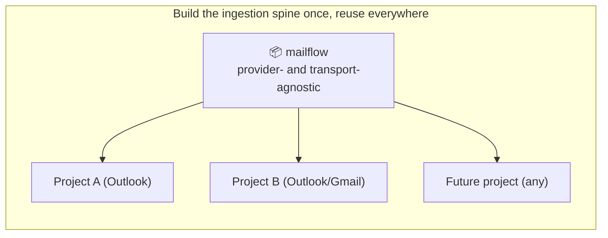


---

## 2. Glossary


| Term                      | Plain-English meaning                                                                                                  |
| ------------------------- | ---------------------------------------------------------------------------------------------------------------------- |
| **Provider**              | The email service: **Gmail** (Google) or **Outlook/Exchange** via **Microsoft Graph**.                                 |
| **Microsoft Graph**       | Microsoft's API for Outlook/Exchange mailboxes. "Outlook provider" = "Graph provider".                                 |
| **Mailbox**               | One email account, e.g. `ops@example.com`.                                                                             |
| **Subscribe / Watch**     | Telling the provider "notify me when this mailbox changes" instead of constant polling.                                |
| **Push notification**     | A provider-originated "something changed" signal. Usually a *pointer*, not the email itself.                           |
| **Pub/Sub**               | Google Cloud message queue. Gmail delivers push notifications here.                                                    |
| **Webhook**               | A public HTTPS URL of ours that Graph calls directly (Graph does not use Pub/Sub).                                     |
| **Cursor**                | A per-sync-stream bookmark: Gmail `historyId` (per mailbox), Graph `deltaToken` (**per folder**).                      |
| **Sync stream**           | The unit a cursor bookmarks. Gmail: one stream per mailbox. Graph: one stream per *mailbox folder*.                    |
| **Sweep / poll**          | A periodic "what changed since my cursor?" pass — the safety net for missed pushes.                                    |
| **MIME**                  | The encoding of an email (headers + nested text/HTML/attachment parts).                                                |
| **RFC 5322 headers**      | The email standard: `Message-ID`, `In-Reply-To`, `References`, `From`, `Sender`, `Reply-To`, etc.                      |
| **Message-ID**            | A per-message identifier set *by the sender*. Useful but **not guaranteed present or unique** (§6.1).                  |
| **Port**                  | An interface/contract ("anything that can fetch messages"). The core depends only on ports.                            |
| **Adapter**               | A concrete implementation of a port for one vendor (e.g. the Graph adapter).                                           |
| **Transport / Emitter**   | Where the finished email is handed off: Pub/Sub, Kafka, webhook, etc.                                                  |
| **Idempotency**           | Processing the same email twice has the same effect as once. Required — providers deliver duplicates.                  |
| **DLQ**                   | Dead-letter queue: a side channel for messages that keep failing, so one bad email doesn't block the rest.             |
| **CleanEmail**            | Our normalized, provider-agnostic email object — the thing we emit.                                                    |
| **RBAC for Applications** | The current Exchange Online control to scope an app to specific mailboxes (replaces Application Access Policy). [R-B4] |
| **WIF**                   | Workload Identity Federation — keyless credentials, avoiding downloadable secrets/keys. [R-B5][R-C5]                   |


---

## 3. Goals & non-goals

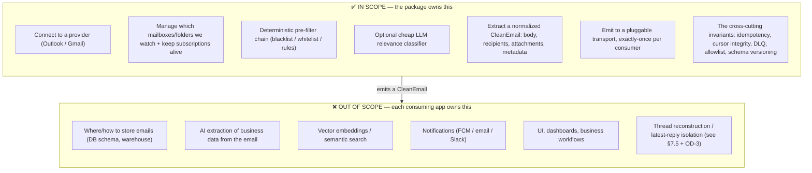


**Decisions already locked** (see [§18 Decision log](#18-decision-log)): the language is Python; the job is exactly *Connect → Filter → Extract → Hand off, plus the safety rules*; it ships as a **library you import** plus an **optional ready-made deployment example** you can copy; and the first email service we support is **Microsoft Graph (Outlook)**.

**Choices we made on purpose, so the safe behavior is the default:**

- When the optional AI decides an email probably isn't relevant, we **mark it and keep it — we don't delete it** ([OD-2](#od-2-drop-vs-flag)).
- The filters that *delete* mail ship **turned off and empty**, so the toolkit can never silently throw away a project's real mail until that project deliberately turns them on.

> **You might ask:** why be so cautious about deleting? Because deletion at the front door is invisible and permanent. If a real email gets dropped here, nobody downstream ever sees it, and "why didn't my email arrive?" becomes almost impossible to answer. Keeping-and-flagging is reversible; deleting is not.

---

## 4. The pipeline at a glance

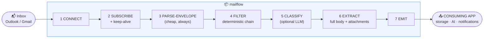


> **Why a separate PARSE-ENVELOPE stage?** Filters need the sender domain, subject, and a snippet — all of which require parsing the message. A full body decode + attachment download before deciding whether to keep the email would be wasteful, and the LLM step depends on having parsed content to judge. So extraction is split: a cheap, mandatory envelope parse (stage 3) gives filters what they need, and the expensive full extract (stage 6) runs only for mail that survives filtering.

Two things are swappable by design (§5): the **provider** (Outlook ⇄ Gmail) and the **transport** (Pub/Sub ⇄ Kafka ⇄ webhook).

---

## 4.5 The whole system (and where this toolkit stops)

The pipeline above is only the *ingestion* part. A real product also stores the mail, makes sense of it, notifies people, and shows it on screens — all of which this toolkit deliberately leaves to the consuming app (§3). It helps to see the full picture once so the boundary is obvious: **this spec is just the blue box; everything green is a separate project that builds on top.**

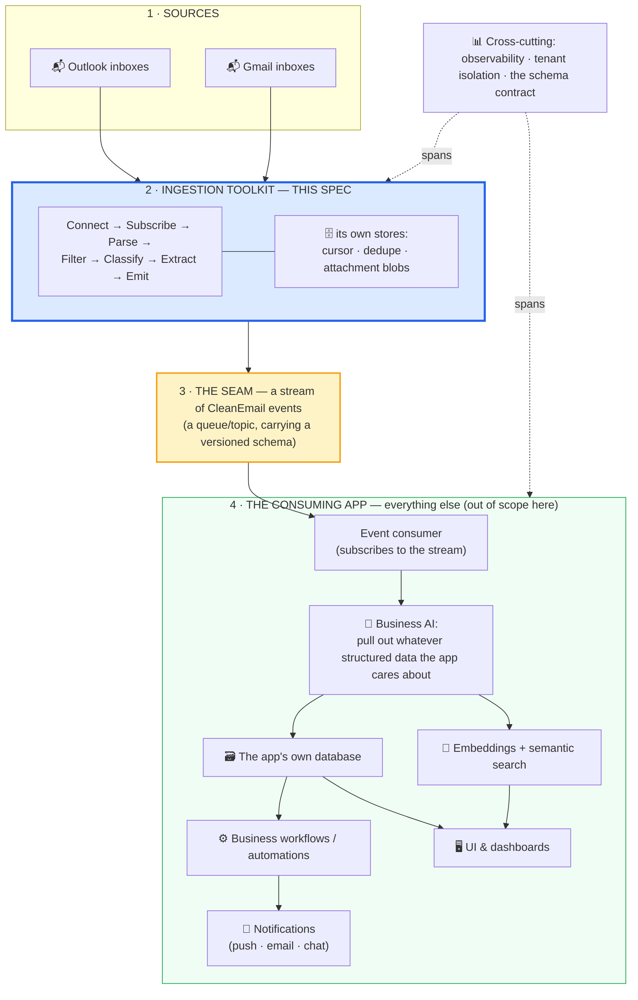


### The one idea that makes it all "integrate"

Everything hinges on **layer 3 — the seam.** The toolkit's *only* job is to put a clean, consistent `CleanEmail` event onto a queue. Everything to the right of that queue is a separate program that simply *reads* events off it. That single handoff is what lets the pieces snap together instead of becoming one tangled system:

- The toolkit doesn't know or care what the consuming app *does* with an email. It just emits.
- The consuming app doesn't know or care whether the email came from Outlook or Gmail, or how subscriptions get renewed. It just reads a `CleanEmail`.
- **The only contract between the two sides is the `CleanEmail` schema and its `schema_version`** (§14). As long as that holds, either side can be rebuilt, redeployed, or replaced on its own.

> **You might ask:** why force a queue in the middle — why not have the toolkit call the storage/AI directly? Because a queue *decouples* them in both time and failure. If a downstream step is slow or down, emails wait safely in the queue instead of jamming ingestion or getting lost — and the correctness rules in §8 already guarantee each email lands on the queue exactly once. Wiring the two together directly would mean a problem in one immediately takes down the other.

### Walking one email all the way through


| Step | What happens                                                                                                                                                  | Who owns it                 |
| ---- | ------------------------------------------------------------------------------------------------------------------------------------------------------------- | --------------------------- |
| 1    | An email arrives in a watched inbox                                                                                                                           | external                    |
| 2    | The toolkit gets the push, removes duplicates, filters out junk, builds a `CleanEmail` (body, sender, attachments streamed to blob storage), and **emits** it | **the toolkit (this spec)** |
| 3    | The event lands on the transport (e.g. a Pub/Sub topic)                                                                                                       | the seam                    |
| 4    | The consuming app reads the event and runs its **own** business AI to pull out whatever structured data it cares about                                        | consuming app               |
| 5    | It saves the result in its **own** database, and optionally embeds the text for search                                                                        | consuming app               |
| 6    | Downstream **workflows** run, the right **people are notified**, and it shows up in the app's **UI / dashboards**                                             | consuming app               |


Steps 1–3 are this spec. Steps 4–6 are a *different* project — and any number of apps could build their own steps 4–6 on top of the same emitted stream. That reuse is the entire reason for building the toolkit once.

### Who owns what (the clean split)


| The toolkit guarantees…                                                       | The consuming app is free to…                                 |
| ----------------------------------------------------------------------------- | ------------------------------------------------------------- |
| Every real email becomes exactly one `CleanEmail` event                       | Decide what the email *means*                                 |
| No duplicates, no silently-dropped mail, no lost bookmark                     | Store it however it likes (relational DB, warehouse, vectors) |
| Attachments safely streamed to blob storage, with just a pointer in the event | Run expensive domain AI and drive business workflows          |
| A stable, versioned event format                                              | Notify people and render dashboards                           |


---

## 5. Architecture: ports & adapters

### 5.1 Why ("ports & adapters" in plain terms)

This is a well-known design pattern. The two words mean:

- A **port** is a *contract* — a list of things something must be able to do, with no detail about how. Think of a wall socket: anything that fits the socket works, and the wall doesn't care what's plugged in. Our example: *"a mailbox provider must be able to connect, list its streams, and fetch messages."*
- An **adapter** is the *actual plug* for one specific vendor — the real code that knows how to talk to Microsoft Graph, or to Gmail. Each adapter fits one port.

The rule we follow: **the core logic only ever talks to ports (the sockets), never to adapters (the plugs).** The core never imports Google's or Microsoft's code directly. Why this matters: "swap Gmail for Outlook" stops being a hopeful promise and becomes a structural fact — to add Outlook you write *one* adapter, and to change where finished emails go you write *one* emitter. Nothing in the core changes.

### 5.2 Diagram

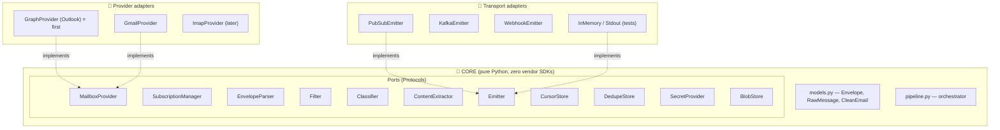


### 5.3 The ports

Ports are written using Python's `typing.Protocol`. In practice this means an adapter just has to *have the right methods* — it doesn't have to inherit from one of our base classes. (This is called "structural typing": if it has the right shape, it fits.)

> **Caveat from research:** Python's `@runtime_checkable` check only confirms that the method *names* exist — it does **not** check that the arguments or return types match, and it's slow. So treat any runtime "does this fit the port?" check as a rough smoke test only. The real safety net is the static type checker (mypy / pyright) you run before shipping, which actually verifies the full shape. [R-D5]

```python
from typing import Protocol, Iterator, Iterable, runtime_checkable

@runtime_checkable
class MailboxProvider(Protocol):
    """CONNECT + fetch one sync stream. Cursor is OPAQUE and PER-STREAM."""
    def connect(self) -> None: ...
    def sync_streams(self) -> Iterable["StreamRef"]: ...        # Gmail: 1/mailbox; Graph: 1/folder
    def fetch(self, stream: "StreamRef", cursor: "Cursor | None") -> Iterator["RawMessage"]: ...
    def message_size(self, ref: "RawRef") -> int | None: ...     # cheap size probe BEFORE download (§8.6)

@runtime_checkable
class SubscriptionManager(Protocol):
    """SUBSCRIBE: create/renew watches; surface provider lifecycle signals."""
    def ensure_watch(self, stream: "StreamRef") -> "WatchHandle": ...
    def renew_watch(self, handle: "WatchHandle") -> "WatchHandle": ...
    def on_lifecycle(self, event: "LifecycleEvent") -> "RecoveryAction": ...  # reauth / removed / missed

@runtime_checkable
class EnvelopeParser(Protocol):
    """Cheap, provider-neutral parse of sender/subject/recipients/snippet — runs BEFORE filters."""
    def parse_envelope(self, msg: "RawMessage") -> "Envelope": ...

@runtime_checkable
class Filter(Protocol):
    name: str
    def evaluate(self, env: "Envelope", ctx: "FilterContext") -> "FilterDecision": ...  # KEEP/DROP/UNCERTAIN

@runtime_checkable
class Classifier(Protocol):
    """Optional relevance scorer. Default policy: annotate, do NOT drop (OD-2)."""
    def classify(self, env: "Envelope", ctx: "FilterContext") -> "Relevance": ...

@runtime_checkable
class ContentExtractor(Protocol):
    def extract(self, msg: "RawMessage", env: "Envelope") -> "CleanEmail": ...

@runtime_checkable
class Emitter(Protocol):
    def emit(self, event: "EmailEvent") -> "EmitReceipt": ...

@runtime_checkable
class CursorStore(Protocol):
    """Per-(tenant, stream) cursor, with monotonic compare-and-set (§8.1, §8.3)."""
    def get(self, tenant: str, stream: "StreamRef") -> "Cursor | None": ...
    def commit_if_ahead(self, tenant: str, stream: "StreamRef", cursor: "Cursor") -> bool: ...

@runtime_checkable
class DedupeStore(Protocol):
    """Atomic claim-before-work (§8.2). Returns False if already claimed/done."""
    def try_claim(self, key: str, lease_seconds: int) -> bool: ...
    def mark_done(self, key: str, ttl_seconds: int) -> None: ...

@runtime_checkable
class SecretProvider(Protocol):
    def get(self, ref: str) -> "SecretStr": ...   # "gsm://proj/secret/v1", "akv://vault/secret", "env://NAME"

@runtime_checkable
class BlobStore(Protocol):
    """Stream attachment bytes to durable storage; emit only a pointer (§6.2)."""
    def put_stream(self, ref: str, chunks: "Iterator[bytes]", content_type: str) -> "BlobRef": ...  # hard byte ceiling, §8.6
    def open(self, ref: "BlobRef") -> "Iterator[bytes]": ...
```

### 5.4 Folder layout

```text
mailflow/
├── pyproject.toml              # extras gate every heavy dependency
├── src/mailflow/
│   ├── __init__.py             # small, curated public API
│   ├── core/
│   │   ├── ports.py            # the Protocols (NO vendor imports)
│   │   ├── models.py           # Envelope, RawMessage, CleanEmail, Recipient, Attachment, Cursor
│   │   ├── events.py           # EmailEvent + SCHEMA_VERSION
│   │   ├── pipeline.py         # the orchestrator
│   │   ├── identity.py         # canonical_id derivation + idempotency key (§6.1)
│   │   ├── errors.py
│   │   └── registry.py         # plugin registry — ALLOWLISTED (§13)
│   ├── config/                 # pydantic v2 schema + layered loader + validate/lint
│   ├── secrets/                # env.py, gcp.py [extra], azure.py [extra]
│   ├── stores/                 # cursor + dedupe + blob adapters (firestore, redis, gcs, memory)
│   ├── providers/
│   │   ├── graph/              # ⭐ Outlook — built FIRST   [extra: graph]
│   │   ├── gmail/              # [extra: gmail]
│   │   └── memory.py           # zero-dep, for tests
│   ├── filters/                # chain, deterministic, llm/ [extra: llm]
│   ├── extract/                # envelope.py, graph.py, gmail.py, mime.py
│   ├── emit/                   # memory, stdout, webhook, pubsub, kafka
│   ├── observability/          # decision trace, metrics, heartbeats (§8.5, §12)
│   ├── builder.py              # config -> wired Pipeline ; also a public hand-wire constructor
│   └── reference/              # OPTIONAL deploy template (Cloud Function / container)
└── tests/
```

---

## 6. Data model: identity, `CleanEmail`, and the RFC spine

### 6.1 Identity (how we tell emails apart)

Every email carries a `Message-ID` header, and it looks like the obvious way to identify an email uniquely. **But we can't rely on it as the key**, for two reasons:

- The email standard (RFC 5322) says a `Message-ID` *should* be present — not *must*. So a perfectly valid email can arrive with **none at all**. [R-D1]
- Even when present, "make it unique" is a rule the *sender's* software is supposed to follow — there's no way for us, the receiver, to enforce it. Buggy email clients, mailing-list software, bounce systems, and "resend" buttons all routinely produce emails with **missing or duplicated** `Message-ID`s. [R-D1]

> **You might ask:** so what *do* we use instead? We split the problem into two separate jobs, because no single field can do both well — see the table below.

So we keep two different keys for two different jobs:


| Job                                                                          | Which key we use                                                                                             | Why this one                                                                                                                                                                                                                                                                                                                                               |
| ---------------------------------------------------------------------------- | ------------------------------------------------------------------------------------------------------------ | ---------------------------------------------------------------------------------------------------------------------------------------------------------------------------------------------------------------------------------------------------------------------------------------------------------------------------------------------------------- |
| **Not processing the same email twice** (the term for this is *idempotency*) | `(tenant, mailbox, provider_message_id)`                                                                 | Each email service gives every message its own id that never changes and is unique within that service and mailbox — exactly what we need to recognize a repeat. We also include `(tenant, mailbox)` so that if the *same* email genuinely lands in two different inboxes we're watching, we treat them as two arrivals, not silently merge them into one. |
| **Grouping emails into conversations** (this is *threading*)                 | the RFC `Message-ID` + `References` + `In-Reply-To` headers (plus a cleaned-up subject and the participants) | These headers are the only conversation hints that every email service shares. Actually *building* the conversation threads is **someone else's job downstream** (OD-3) — we just make sure we *carry* the hints they'll need.                                                                                                                             |


On top of those, every `CleanEmail` gets one more id we generate ourselves, called `canonical_id`, which is **guaranteed to always be present**:

```python
# Use the real Message-ID if we trust it; otherwise build a stable, unique id ourselves.
canonical_id = message_id if message_id_trusted else stable_hash(provider, provider_message_id, mailbox)
```

We also include two simple true/false flags — `message_id_present` and `message_id_trusted` — so downstream code can tell when we had to build the id ourselves versus when the email's own `Message-ID` was usable. And if two clearly-different messages show up sharing the same `Message-ID`, we **flag a warning rather than quietly treating them as the same email**.

> **For the curious:** the well-known way to rebuild conversations from these headers is the JWZ algorithm (it builds a tree from the `References`/`In-Reply-To` headers, fills in gaps for missing parents, and falls back to matching subjects; it was later standardized as IMAP THREAD, RFC 5256). We store everything that algorithm needs, but we leave running it to whoever consumes our output. [R-D2]

### 6.2 `CleanEmail` (what we emit)

Important constraint: once we publish this format, we can only ever *add* fields, never remove or change existing ones (§14 explains why). That means **leaving a field out now is expensive later** — if downstream apps end up needing it, we can't cleanly retrofit it. So the field list below deliberately errs on the side of "include it now," covering the things apps reliably end up needing (which direction the mail went, the real sender vs. reply-to address, whether it was an auto-reply, mailing-list headers) plus one catch-all escape hatch (`raw_headers`) that keeps every original header in case we missed something.

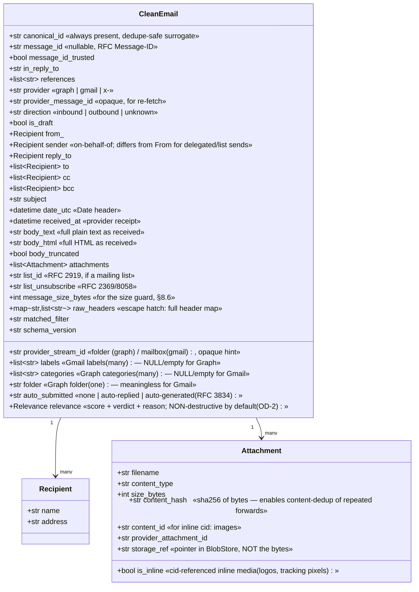


**Two design notes:**

1. **Labels, categories, and folder are separate fields.** Gmail has *many labels and no folder*; Graph has *categories AND exactly one folder*. [R-C / R-B / §10] Merging them into a single `tags` field would lose meaning for both providers, so they are three distinct fields with explicit "empty for the other provider" semantics.
2. **Attachment `content_hash`** lets a consumer skip re-processing the same PDF forwarded repeatedly. `is_inline` is set when a part has a `Content-ID` referenced via `cid:` in the HTML and/or `Content-Disposition: inline` (RFC 2392 / RFC 2183). [R-D4]

> **Why `storage_ref`, not bytes?** Attachments can be up to 150 MB (Graph) (§10). We stream them to a `BlobStore` and emit only a pointer, keeping the event small and the queue fast (Pub/Sub caps a message at 10 MB anyway [R-C6]).

---

## 7. Pipeline stages in detail

### 7.1 Stage 1 — CONNECT

Log in and get a working connection to the email service. We use **app-only** login — meaning the *application itself* is granted access by an administrator once, rather than each individual user clicking "allow." (The trade-off: app-only is convenient and unattended, but by default it can read a *lot* of mailboxes, which is exactly why §9 spends so much effort narrowing it down.)


|                  | Gmail                                                                                      | Outlook / Graph                                                                                                            |
| ---------------- | ------------------------------------------------------------------------------------------ | -------------------------------------------------------------------------------------------------------------------------- |
| Auth             | Per-user OAuth **(preferred)** or service-account **domain-wide delegation**               | App registration + `Mail.Read` **application** permission (admin consent)                                                  |
| Keyless          | **Workload Identity Federation** to avoid downloadable SA keys [R-C5]                      | **Federated identity credential / managed identity** to avoid a stored client secret [R-B5]                                |
| Mailbox scoping  | Impersonate only allowlisted users; least scope (`gmail.readonly`/`gmail.metadata`) [R-C5] | **RBAC for Applications** in Exchange Online (replaces Application Access Policy) scopes the app to a mailbox group [R-B4] |
| Credentials from | `SecretProvider` (never hardcoded)                                                         | `SecretProvider` (never hardcoded)                                                                                         |


> 🔒 The default app-only models can read **every** mailbox in the org. Scoping must be enforced at the **credential/IAM layer**, not just in our code — see §9.

### 7.2 Stage 2 — SUBSCRIBE (and keep it alive)

> **Push = a hint. Poll = the truth.** We listen to push for latency, but a periodic **sweep** guarantees we never silently miss mail.

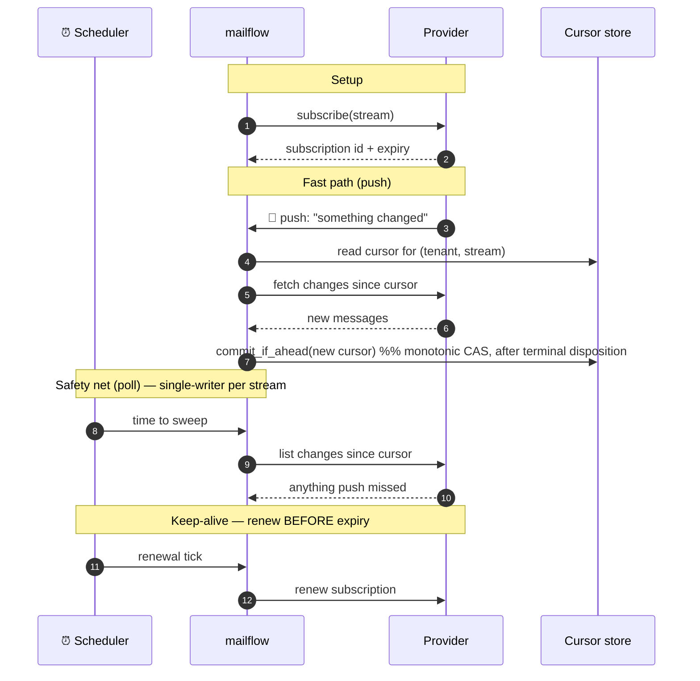


**Grounded expiry & renewal numbers** (bake into the scheduler):


| Provider                                                    | Subscription max life                       | Renew at                                     | Source |
| ----------------------------------------------------------- | ------------------------------------------- | -------------------------------------------- | ------ |
| Gmail `users.watch`                                         | ~7 days; stops if not renewed within 7 days | **daily** (Google's explicit recommendation) | [R-C1] |
| Graph mail subscription, **no resource data**               | **10,080 min** (under 7 days)               | every **~12–24 h**                           | [R-A1] |
| Graph mail subscription, **with resource data** (encrypted) | **1,440 min** (under 1 day)                 | every **~12 h**                              | [R-A1] |


> ⚠️ Graph also clamps any requested expiry under 45 minutes to 45 minutes, and rejects requests beyond the max. [R-A1] If renewal dies, ingestion stops **silently** — see the dead-man's-switch in §8.5.

**Graph lifecycle signals must be handled** (subscribe a `lifecycleNotificationUrl`; it cannot be added later via PATCH) [R-A4]:


| Event                     | Meaning                                                                     | Action                                                                                                          |
| ------------------------- | --------------------------------------------------------------------------- | --------------------------------------------------------------------------------------------------------------- |
| `reauthorizationRequired` | Token/subscription about to expire, or consent revoked; notifications pause | Reauthorize (`POST /reauthorize`) **or** renew (`PATCH`), then delta-sync the gap. Don't do both within 10 min. |
| `subscriptionRemoved`     | Graph dropped the subscription                                              | Create a new subscription, then delta-sync to recover the gap                                                   |
| `missed`                  | Some notifications weren't delivered (e.g. throttling)                      | Full delta resync to find the undelivered changes                                                               |


### 7.3 Stage 3 — PARSE-ENVELOPE (cheap, always runs)

Produce a provider-neutral `Envelope` (parsed `from`/`sender`/`reply-to`, recipients, subject, date, a snippet/`bodyPreview`, key headers) **without** decoding the full body or downloading attachments. Graph gives structured addresses and a `bodyPreview` for free; Gmail requires parsing raw header strings. This makes filtering cheap and removes the filter↔extract circular dependency.

### 7.4 Stage 4 — FILTER (deterministic chain, three-valued)

Cheap, rule-based filters run before any spend. Each returns **KEEP** (accept, stop), **DROP** (reject, stop), or **UNCERTAIN** (no opinion, fall through).

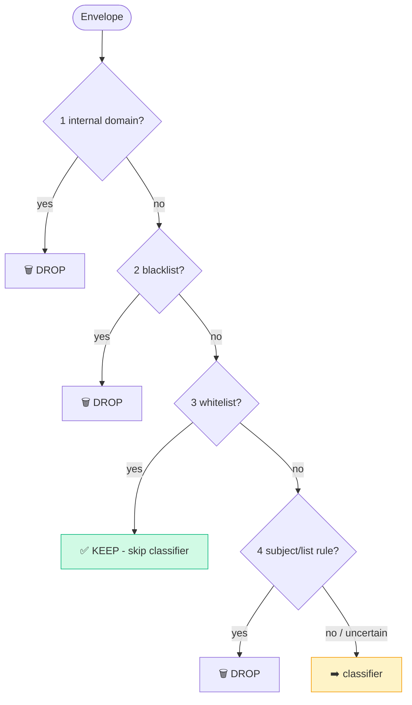


> **Why three values?** A blacklist has *no opinion* on an address that's on no list. `UNCERTAIN` lets cheap filters narrow the funnel and pass only the genuinely-ambiguous remainder onward.
>
> **Opinionated default:** destructive filters (internal-domain, generic-domain, blacklist) ship **empty** in the default config. A reusable toolkit must not delete a project's legitimate mail — small businesses and individuals routinely email from consumer domains like `gmail.com` — so each project opts into destructive rules explicitly.

`List-Id` / `List-Unsubscribe` / `Auto-Submitted` are available to filters for free (parsed in stage 3) and answer "is this a newsletter / auto-reply?" deterministically — cheaper and more reliable than asking an LLM. [R-D3]

### 7.5 Stage 5 — CLASSIFY (optional LLM relevance)

For mail still `UNCERTAIN`, optionally ask a cheap LLM "is this relevant?" Everything is configurable (model, key, prompt, threshold).

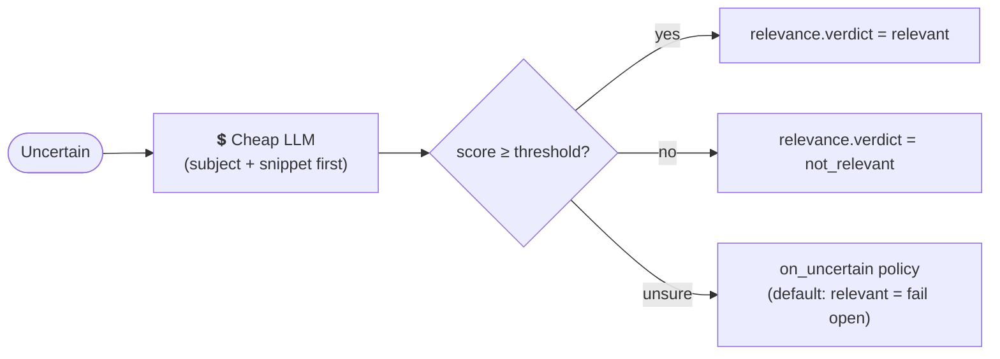


> **Default = mark it, don't delete it ([OD-2](#od-2-drop-vs-flag)).** Deleting an email at the front door can't be undone and makes "why didn't my email arrive?" impossible to answer. So by default the classifier just writes its verdict onto the `CleanEmail` and passes it along; a project can opt into actually dropping not-relevant mail if it wants. When the AI is genuinely unsure, the default is to **"fail open"** — treat it as relevant and keep it. ("Fail open" means *when in doubt, err toward letting things through* rather than blocking them; the opposite, "fail closed," would mean blocking when unsure.) **Cost guardrails (required):** a hard cap on how much text we send the AI, sending just the subject + a snippet rather than the whole body, and a per-customer spending limit that trips a breaker and alerts when hit. **Privacy note:** sending email content to an outside AI means it leaves our walls — see §9.8.

### 7.6 Stage 6 — EXTRACT (only for kept mail)

Turn the raw provider message into a `CleanEmail`: parse recipients to `{name, address}`, decode body (prefer `text/plain`, fall back to HTML from `multipart/alternative`), normalize headers into `raw_headers`, set `direction` (inbound vs outbound), and separate real attachments from inline media.

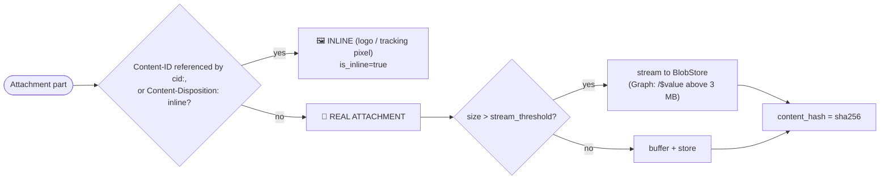


Provider attachment specifics (grounded): Graph returns `contentBytes` (base64) for small attachments but you should fetch `/$value` (raw bytes) above ~3 MB, and Graph caps request bodies near 4 MB so large items must be streamed; the `attachment` resource exposes `size` for a pre-download probe. [R-B3] Gmail returns body data base64url and large attachment bodies via a separate `attachments.get`. [R-C4]

### 7.7 Stage 7 — EMIT

Hand the `EmailEvent` (wrapping `CleanEmail`) to the configured transport. Idempotency is finalized here: the dedupe claim taken at intake (§8.2) is marked **done** only after a successful emit.

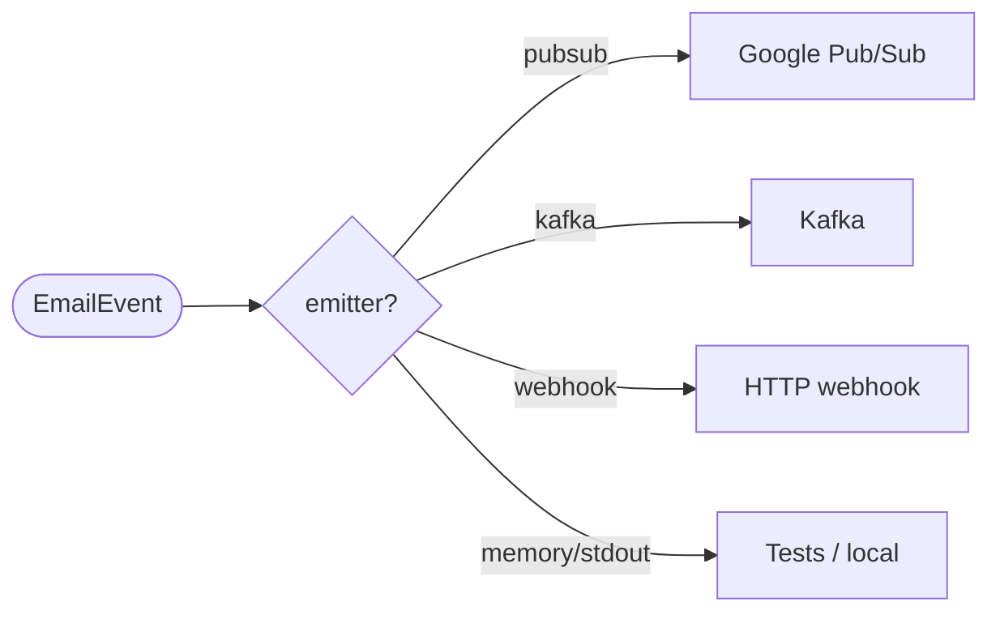


---

## 8. The rules that keep it correct and reliable

An *invariant* is a rule that must **always** hold true, no matter what. The ones below each guard against a specific way the system could quietly break. They're cheap to build in from the start and painfully expensive to bolt on later — so they're **non-negotiable for version 1, even if we cut features to make room for them.**

> **You might ask:** why are these such a big deal? Because every one of them fails *silently*. The system looks like it's working — no error, no crash — while it slowly drops mail, processes the same email twice, or stops ingesting entirely. By the time someone notices, the damage is done and hard to trace. These rules turn silent failures into either correct behavior or a loud alert.

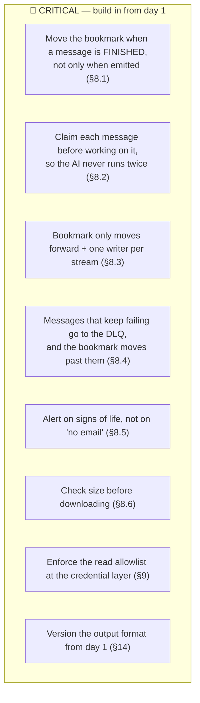


### 8.1 Move the bookmark when a message is *finished* — not only when it's emitted

First, the vocabulary:

- A **cursor** is our bookmark in the stream of changes — "I've handled everything up to here." Next time we ask the provider "what's new?", we ask starting from the bookmark.
- A message is at a **terminal disposition** when we're truly *done* with it, one way or another. There are four ways to be done: we **emitted** it, a filter **dropped** it, we recognized it as a **duplicate** and skipped it, or it was broken and we sent it to the **dead-letter queue** (DLQ — see §8.4).

**Rule:** advance the bookmark when a message reaches **any** of those four finished states — not only when it's emitted. Recognizing a duplicate and skipping it still counts as "done" and **must** move the bookmark forward. (We save the new bookmark once per batch, after every message in that batch has reached a finished state.)

**Why:** suppose we only moved the bookmark on emit. Now a duplicate arrives, we correctly skip it (so there's no emit) — but the bookmark never gets past it. We'd re-fetch that same message forever, and newer mail sitting behind it would never get processed. Counting "skipped as duplicate" as finished is what lets the bookmark move on.

### 8.2 Claim a message before working on it (so we never process it twice)

Why duplicates are guaranteed, not just possible: we run many copies of the function at once (to handle load), and **both email services promise "at-least-once" delivery** — meaning they may hand us the same message more than once on purpose. So two copies of our code *will* sometimes receive the same email at the same moment.

**Rule:** the instant a message arrives, do a single **atomic** write that claims it: `try_claim((tenant, mailbox, provider_message_id), lease)`. "Atomic" means all-or-nothing and only-one-winner — for example Firestore's "create only if it doesn't exist" or Redis's `SET NX`. Exactly one copy wins the claim and does the work; the others see the claim already exists and **stop immediately, before spending anything on the AI classifier or the full extraction.** The claim carries a **lease** (a short expiry), so if the winner crashes mid-way, the claim eventually frees up and another copy can retry. Once the email is successfully emitted, we mark the claim `done` (kept for a while via a TTL, then cleaned up).

> **You might ask:** why does it have to be one "atomic" write — why not just *check* whether we've seen it, then *record* that we have? Because that's two separate steps with a gap in between. Two copies running at once could both do the check during that gap, both see "nope, never seen it," and both go on to pay for the AI call and emit a duplicate. A single all-or-nothing claim removes the gap entirely — there's no moment where two copies can both think they're the first.

### 8.3 The bookmark only moves forward, and only one writer touches it at a time

The setup: two things can ask "what's new?" on the same stream at the same time — the fast push path and the periodic safety-net sweep (§7.2). If we just let the last one to finish win, here's the bug: a *slow* sweep that started with an *old* bookmark could finish last and overwrite a *newer* bookmark the push path already saved. The bookmark would jump **backwards**, and we'd re-process everything in between.

**Rule, two parts:**

1. **Forward-only (the term is "monotonic"):** `commit_if_ahead` saves a new bookmark *only* if it's strictly newer than the one already stored. An older bookmark trying to overwrite a newer one is rejected.
2. **One writer at a time:** for each `(tenant, stream)`, only one thing may change the bookmark at once — enforced with a lock, or by funneling push and sweep through a single worker per stream that just re-checks whenever a "something changed" flag is set.

The atomic claim from §8.2 is the final safety net if any double-fetch slips through anyway.

> **The exact details, grounded in the vendor docs:** Gmail's bookmark (`historyId`) is **per mailbox**. Graph's bookmark (`delta` token) is **per folder** — there's no mailbox-wide version; the folder is required in the URL. [R-B1] So our bookmark store is keyed on `(tenant, stream)`, where a "stream" means a whole mailbox (Gmail) or a single folder within a mailbox (Graph). The two services also signal a "your bookmark is too old, start over" differently: Gmail returns **HTTP 404** [R-C3]; Graph returns **410 Gone** (reset) or a `40X`/`syncStateNotFound` (token expired) [R-B1]. And Graph's Outlook bookmarks have **no fixed expiry** — they're dropped from a limited-size cache whenever it fills up — so we have to assume one can expire at any time. [R-B1]

### 8.4 Handling messages that keep failing (the dead-letter queue)

Background terms:

- A **dead-letter queue (DLQ)** is a side bin for messages we can't process. Setting a bad one aside keeps it from blocking all the good mail behind it.
- A "**poison message**" is one that fails every time we try — too big, malformed, etc.

**Rule:** after a message has failed too many times (`max_attempts`), move it to the DLQ *with a reason* and treat that as one of the four "finished" states from §8.1 — so the bookmark advances right past it. We have to count the attempts ourselves (in the claim record from §8.2), because neither email service counts retries for us.

> **You might ask:** other queue systems have an "ack" (acknowledge) to say "stop sending me this" — why not just use that? Because neither Gmail nor Graph offers a per-message acknowledgement. Graph re-pushes whenever a lifecycle event fires, and the *only* thing that stops it from re-fetching a message is **moving the bookmark past it** [R-A4]. Gmail's notification is just a "something changed up to here" marker with no per-message identity at all. So for these two services, "stop redelivering this" can only be expressed as "move the bookmark forward." (The separate Pub/Sub-level ack still exists, but it's a different layer, handled in the emitter.)

```mermaid
sequenceDiagram
    autonumber
    participant Prov as Provider
    participant MF as mailflow
    participant DLQ as Dead-letter queue
    participant Ops as On-call
    Prov->>MF: deliver malformed / oversized message
    MF->>MF: process → throws; retry (transient?) → still fails
    MF->>DLQ: move message + reason (attempt >= max)
    MF->>MF: mark terminal → advance cursor past it
    DLQ->>Ops: 🚨 DLQ-rate alert
    Note over MF,Prov: queue keeps flowing; cursor moves on
```


### 8.5 Don't alert on "no email" — alert on signs of life we control ("heartbeats")

A **dead-man's-switch** is an alarm that goes off when an expected *regular* signal stops. The trap to avoid: using "we haven't received any email" as that signal. A real inbox is quietly empty all night and all weekend, so silence tells us nothing — it could be normal, or it could mean ingestion has died. Instead we watch signals that *should* keep ticking no matter what, and alert when one stops:

- **Renewal heartbeat:** every time we successfully keep a subscription alive, we record the time. Alert if too long passes since the last one (`now − last_renew > interval + margin`).
- **Sweep heartbeat:** the safety-net sweep runs on a fixed schedule whether or not there's mail. Alert if a sweep hasn't completed in several cycles (this just proves the scheduled job itself is still running).
- **Synthetic canary (recommended):** every so often, send a test email to each watched mailbox and check it comes all the way through within the expected time. This is the only check that proves the *entire path* works even during a genuinely quiet period.

### 8.6 Check the size *before* downloading

A huge message (say 200 MB) has to be sent to the DLQ **without** first loading it into memory. Here's the trap: if we download it first, the process can run out of memory and crash *before* it manages to set the message aside — and then that same giant message gets re-fetched and crashes us again, jamming the whole stream forever. The fix is simple: both services let us read a message's size cheaply, *without* downloading the body, so we check the size first and refuse oversized ones up front.

- Gmail: `sizeEstimate` on the message; attachment bodies fetched separately. [R-C4]
- Graph: the `message` resource **has no `size` in v1.0** [R-B6] — so probe via the `PidTagMessageSize` extended property (or read the per-attachment `size` before download). ⚠️ The extended-property route is a community-documented pattern, not stated on the v1.0 message page — **verify against the SDK at build time** ([U-2](#u-2-graph-message-size)).

**Rule:** enforce `max_message_bytes` / `max_attachment_bytes` against *metadata* at fetch time; route oversized items to DLQ **without downloading bytes**. (Note base64 inflates wire size ~33% [R-D4], so budget headroom.) Streaming large *legitimate* attachments is a later optimization; the size *guard* ships in v1 and is independent of streaming.

### 8.7 Keep "start over from scratch" from blowing up

When a bookmark expires (§8.3), we have to re-sync the mailbox from scratch — and on a big, old mailbox that could mean walking through years of mail. So "full re-sync" must be **actually bounded**, three ways:

- **Only go back so far:** re-sync only mail newer than a configurable window (e.g. the last 14–30 days), not all history.
- **Reuse the duplicate check:** the §8.2 claim means already-seen mail is recognized instantly and skipped — no AI cost, no re-emit, just a cheap lookup.
- **Don't stampede:** limit how many mailboxes re-sync at once per tenant. Otherwise a flood of requests trips the providers' rate limits (Graph: 10,000 requests / 10 min and 4 at a time per app+mailbox — obey the `Retry-After` it sends back; Gmail: a per-user quota — back off and retry with growing delays on a `429`). [R-B2][R-C6]

### 8.8 Delivery order is "usually right," never guaranteed

Setting an `ordering_key` of the mailbox on Pub/Sub keeps emails from one mailbox in order *as we hand them off* — but that's the only place order is preserved. The email services themselves can still hand us a reply *before* the original it replies to. **So say this clearly in the docs:** the order we emit in is best-effort only, and downstream code must cope with out-of-order arrivals (e.g. wait for and stitch together messages using the `References` header). There's also a cost to forcing order: if one message gets stuck, everything behind it in that mailbox's line is stuck too ("head-of-line blocking"). So we default to **unordered** emit, and only turn ordering on for a consumer that genuinely needs it and accepts that trade-off.

---

## 9. Security & multi-tenancy

The principle that runs through this whole section: **a check inside our own code is a helpful extra layer, but it is never the real boundary.** Any check we write, we (or a bug, or a future code path) can also accidentally skip. The boundary that actually *can't* be bypassed is the one the cloud platform enforces on the credential itself — what the login is even *allowed* to read. So we put the real limits there.

### 9.1 Make the credential itself the limit on what we can read

- **Graph (Outlook):** restrict the app to a specific group of mailboxes using **RBAC for Applications** (Microsoft's current feature for this; it replaces the older "Application Access Policy"). [R-B4]
  > ⚠️ **Easy mistake here:** the app's real permissions are the *combination* of two separate grants — the Entra one and the Exchange RBAC one. If you scope the Exchange side but leave a broad Entra `Mail.Read` grant in place, the broad one wins and your scoping does **nothing**. You have to *remove* the unscoped grant. Also, these changes take 30 min–2 h to take effect, so don't assume a failed test means you did it wrong. [R-B4]
- **Gmail:** prefer per-user OAuth, where one login can read exactly one mailbox. If you must use domain-wide delegation instead, grant only the narrowest scopes (`gmail.readonly` / `gmail.metadata`). [R-C5]
- **Prove it at startup:** when the app boots, deliberately try to read a mailbox that's *not* on our allowlist and confirm the provider refuses (returns a 403). We *also* keep an allowlist in our own code as a backup — it fails closed (an empty allowlist reads **nothing**) — and we put it inside the provider adapter so that *every* path goes through it, including the "connector only" usage in §12.

### 9.2 Don't keep long-lived passwords or keys lying around

The safest secret is one that doesn't exist to be stolen. Use **keyless** login wherever possible — Workload Identity Federation on Google Cloud, and federated identity credentials / managed identity on the Microsoft side — so there's no downloadable key file or stored password to leak in the first place. [R-B5][R-C5] If a stored secret genuinely can't be avoided, then: rotate it automatically (at least every 90 days, and alert when one is getting old) and write down a step-by-step runbook for revoking it fast if it leaks.

### 9.3 Lock down the public webhook (Graph)

Graph notifies us by calling a public HTTPS URL of ours (the "webhook"). Public means *anyone* can call it, so we can't trust what it says at face value:

- **Setup handshake:** when Graph first registers the webhook it sends a `validationToken`; we must echo it back exactly (as plain text, URL-decoded, HTTP 200) **within 10 seconds**, or Graph won't create the subscription. [R-A2]
- **`clientState` is a tripwire, not a password.** It's a short shared secret (≤128 chars) Graph includes in each notification. It can easily end up copied into logs or the DLQ, so: compare it in constant time, **never log it**, and strip it out of anything we store. It helps spot obviously-forged calls — but it is *not* strong proof of who's calling. [R-A3]
- **Real proof = "did *we* set up this subscription, and what does *our own* fetch say?"** Don't trust the contents of the notification. Match its `subscriptionId` against our own records, then go **re-fetch the actual message using our own authenticated connection.** The notification is treated as nothing more than a nudge saying "go look." (If we ever use the richer encrypted notifications that carry content, we additionally verify their signature against Microsoft's known app id `0bf30f3b-...` and decrypt with our certificate. [R-A5])
- **Guard against floods and replays:** ignore repeats by deduping on `(subscriptionId, resourceData.id)` for a while; put a rate limit in front of the endpoint (a flood of fake notifications could otherwise balloon our AI bill); and reply `202` fast — within Graph's ~3-second window — then do the real work afterward. [R-A1]
- **Gmail is different:** its notifications come through Pub/Sub, and we authenticate them by verifying the signed token Google attaches (checking the issuer, the audience, that the sender address is the service account we expect, and that it's verified). Note the token can be up to an hour old. [R-C2]

### 9.4 Keep tenants ("customers") fully separated

A **tenant** is one customer/project whose mail we handle. We never want one tenant's data or credentials to leak into another's, so tenant is built into everything: separate credentials, separate queues, separate bookmark/dedupe namespaces, and separate storage folders per tenant. Two rules matter most:

- **Figure out which tenant a notification belongs to from *our own* records — never from the notification itself.** A forged notification could otherwise claim to be any tenant.
- **Enforce the separation at the cloud-permission layer, not just by naming.** Each tenant's identity can read only its own secrets, and we reject any attempt to read a secret belonging to a different tenant. Naming a secret `gsm://<tenant>/...` by convention is *not* isolation on its own — the permissions have to actually forbid crossing over.

For the ready-made deployment, prefer **one tenant per running instance**, so the process boundary itself becomes the wall between tenants.

### 9.5 Handle secrets carefully

Wrap every secret we load in `pydantic.SecretStr`. This is a simple safeguard: it stops the secret from being accidentally printed into logs, error traces, or the DLQ when some object gets dumped to text. [R-D7] Beyond that: load secrets only when needed, hold them only briefly, and never keep one tenant's decrypted secret cached where another tenant's request could reach it.

### 9.6 Don't auto-run third-party plugin code (see §13)

The plugin system (§13) lets extra packages register code with us. The danger: if we *automatically* loaded every plugin that happened to be installed, then **any** package on the machine — including one pulled in indirectly by another dependency, or a typosquat with a name one letter off — could quietly register code that runs *inside our process*, where it can reach the authenticated mail connections and the decrypted secrets. That's full mailbox and secret theft. [R-D6] So we **never auto-load.** We load only the specific plugins a tenant explicitly lists in config, pinned to exact versions and checked against a known hash; everything else is ignored. And plugins are handed only the small piece of data they need — never the live mail connection.

### 9.7 Plan for the life of the personal data (must be done before any real customer)

Emails and attachments are sensitive personal data (PII), so we have legal obligations around them. We still need to design: encryption while stored (per-tenant keys where required), logging of who accessed what, automatic deletion after a set retention period (for both the dedupe records and the stored attachments), and a **"delete everything about this email" path** — keyed on `(tenant, canonical_id)` — that wipes our dedupe and attachment storage and tells downstream consumers enough for them to delete their copies too. None of this is designed yet, and it has to be before we onboard a real customer ([U-4](#u-4-pii-lifecycle)).

### 9.8 Sending email content to an outside AI is a privacy decision, not just a cost

When the optional classifier runs, it ships email content to a third-party AI service — that content is *leaving our walls*, which is a privacy and compliance matter on top of the cost. So: get a written agreement that the AI vendor won't retain the content or train on it; make the classifier **opt-in per tenant with recorded consent**; offer a "rules-only, no AI" mode and region-specific endpoints for customers with data-residency requirements; send only the smallest slice of the email needed; and never log the content.

---

## 10. Provider cheat sheet (grounded)

All figures sourced in §17.


| Concern                 | Gmail                                                          | Microsoft Graph (Outlook)                                                                                  | Source       |
| ----------------------- | -------------------------------------------------------------- | ---------------------------------------------------------------------------------------------------------- | ------------ |
| **Push delivery**       | Cloud **Pub/Sub** topic                                        | Direct HTTPS **webhook**                                                                                   | [R-C1][R-A1] |
| **Setup handshake**     | None (Pub/Sub IAM)                                             | Echo `validationToken` as `text/plain`, 200, **≤10 s**                                                     | [R-A2]       |
| **Push payload**        | `{emailAddress, historyId}` watermark (base64url) — no content | `{subscriptionId, changeType, resource, resourceData.id, clientState}`; optionally encrypted resource data | [R-C1][R-A5] |
| **Subscription life**   | watch ~7 days; renew **daily**                                 | 10,080 min (no data) / 1,440 min (with data); renew well before                                            | [R-C1][R-A1] |
| **Lifecycle signals**   | none (just re-watch)                                           | `reauthorizationRequired`, `subscriptionRemoved`, `missed` — must handle                                   | [R-A4]       |
| **Incremental fetch**   | `history.list(startHistoryId)` → ids to hydrate                | `messages/delta` **per folder** → changed messages + `@odata.deltaLink`                                    | [R-C3][R-B1] |
| **Cursor scope**        | `historyId` per **mailbox**                                    | `deltaToken` per **folder**; no fixed lifetime                                                             | [R-C3][R-B1] |
| **Cursor invalidation** | **404** → full sync                                            | **410 Gone** or `40X`/`syncStateNotFound` → full resync                                                    | [R-C3][R-B1] |
| **Auth**                | per-user OAuth or DWD; scopes `gmail.readonly`/`metadata`      | app permission `Mail.Read` + **RBAC for Applications**                                                     | [R-C5][R-B4] |
| **Keyless**             | Workload Identity Federation                                   | Federated identity credential / managed identity                                                           | [R-C5][R-B5] |
| **Body shape**          | `format=raw` (base64url RFC 822) or `format=full` MIME parts   | pre-assembled `body` + `bodyPreview`                                                                       | [R-C4][R-A5] |
| **Addresses**           | raw header strings to parse                                    | structured `{name, address}`                                                                               | [R-B][R-A]   |
| **Attachments**         | base64url; large via `attachments.get`                         | `contentBytes` <3 MB; `/$value` ≥3 MB; req body ~4 MB cap; up to 150 MB                                    | [R-C4][R-B3] |
| **Message size probe**  | `sizeEstimate`                                                 | no `size` on v1.0 `message` → `PidTagMessageSize` ext. prop (verify)                                       | [R-C4][R-B6] |
| **Tags model**          | flat **labels** (many)                                         | **categories** (many) + **folder** (one) — don't merge                                                     | [R-C][R-B]   |
| **Throttling**          | quota units/user/min (6,000); 429 → exp. backoff               | 10,000 req/10 min + 4 concurrent per app+mailbox; 429 + `Retry-After`                                      | [R-C6][R-B2] |
| **Per-mailbox sub cap** | n/a                                                            | 1,000 active subscriptions per mailbox (all apps)                                                          | [R-A7]       |


---

## 11. Configuration

Everything is data, layered for override without code changes. Secrets are **references**, resolved lazily as `SecretStr`. Precedence (low→high): package defaults → `mailflow.yaml` → environment variables → per-tenant overlay (DB/secret store).

```yaml
provider:
  kind: graph                       # graph | gmail | memory
  options: { tenant_id: "...", client_id: "...", mode: delta }
  auth: { method: federated_identity }   # federated_identity | managed_identity | client_secret
  secret_refs: { client_secret: "akv://vault/graph-secret" }   # single string convention

subscriptions:
  streams: ["ops@example.com:Inbox", "bids@example.com:Inbox"]  # mailbox[:folder] (folder for Graph)
  watch_renew_minutes: 720          # 12h, well under the limit

security:
  read_allowlist: ["ops@example.com", "bids@example.com"]   # fail-closed; empty = read nothing
  verify_scope_on_startup: true

filters:                            # ORDERED list = the chain. Destructive filters default EMPTY.
  - { kind: whitelist, on_match: keep, params: { domains: ["trustedpartner.com"] } }
  - { kind: subject, on_match: drop, params: { drop_patterns_file: "filters/drop.txt" } }
  # internal_domain / blacklist intentionally omitted by default — opt in per project.

classifier:
  enabled: false                    # opt-in; egress to a third-party LLM (see §9.8)
  policy: flag                      # flag (default, non-destructive) | drop
  model: claude-haiku-4
  api_key: "gsm://acme/anthropic-key/latest"
  max_input_tokens: 4000            # hard cost cap
  on_uncertain: relevant            # fail open
  budget: { per_tenant_daily_usd: 5.0 }   # breaker trips + alerts

stores:
  cursor: { kind: firestore, collection: cursors }
  dedupe: { kind: firestore, collection: dedupe, ttl_days: 60 }
  blob:   { kind: gcs, bucket: acme-attachments, prefix: "{tenant}/" }

emitter:
  kind: pubsub                      # pubsub | kafka | webhook | memory | stdout
  options: { project: acme-ops, topic: clean-emails, ordered: false }

observability:
  decision_trace: { enabled: true, sink: log }   # answers "why was my email dropped?" (§12)
```

`mailflow validate <file>` checks every `kind` against the (allowlisted) registry with typo suggestions, prints the resolved filter chain in order with reachability warnings (a KEEP short-circuit before an unreachable DROP), compiles regex pattern files, and flags unknown keys.

---

## 12. Using only a subset

Each stage is independently importable; heavy deps are gated behind extras (`pip install mailflow[graph,gcp]`). **Setup cost is labeled honestly per example.**

**(a) Full pipeline, config-driven** — *Setup: full provider auth + stores (see §15 Day-0 checklist). The only zero-setup path is `provider: memory`.*

```python
from mailflow.builder import build_from_config
pipeline = build_from_config("mailflow.yaml", tenant="acme")
report = pipeline.run_once()   # report includes per-stage keep/drop counts + sample reasons
```

**(b) Parser only** — *Setup: none. Note: Gmail/IMAP give raw RFC822; Graph gives a JSON body object, so use the matching extractor.*

```python
from mailflow.extract.mime import MimeExtractor          # for raw RFC822 bytes (Gmail format=raw / IMAP)
clean = MimeExtractor().extract_bytes(raw_rfc822_bytes)
# from mailflow.extract.graph import GraphExtractor      # for a Graph message JSON object
```

**(c) Filters only** — *Setup: none.*

```python
from mailflow.core.models import Envelope
from mailflow.filters.chain import FilterChain
from mailflow.filters.deterministic import WhitelistFilter, SubjectFilter
env = Envelope.from_dict(my_dict)                          # public factory; no provider needed
decision = FilterChain([WhitelistFilter(domains={"partner.com"}), SubjectFilter(...)]).run(env)
```

**(d) Connector only** — *Setup: full Graph auth. Note: `fetch(None)` triggers a bounded initial sync — pass `limit`/`since`.*

```python
from mailflow.providers.graph import GraphProvider
provider = GraphProvider(tenant_id=..., client_id=..., secret_ref="env://GRAPH_SECRET")
for raw in provider.fetch(stream="ops@example.com:Inbox", cursor=None):  # honors read_allowlist
    ...
```

**(e) Hand-wired pipeline** — *no config/registry; construct ports directly.*

```python
from mailflow.core.pipeline import Pipeline
pipe = Pipeline(provider=p, parser=parser, filters=[...], extractor=ex, emitter=em,
                cursor_store=cs, dedupe_store=ds)
```

**Consumer debuggability (the #1 support question, "why was *my* email dropped?"):** every message produces a structured **decision trace** regardless of outcome (`{canonical_id, tenant, verdict, stage, matched_filter, reason, relevance_score}`), and `mailflow replay --config x.yaml --since 30d --no-emit` runs the full filter+extract path over historical mail read-only and prints a keep/drop/uncertain breakdown — so config can be validated without testing in production.

---

## 13. Extending it without forking (plugins)

Teams add a provider/filter by **installing a package** that declares Python entry points (the mechanism pytest/Airflow use, via `importlib.metadata.entry_points`). [R-D6]

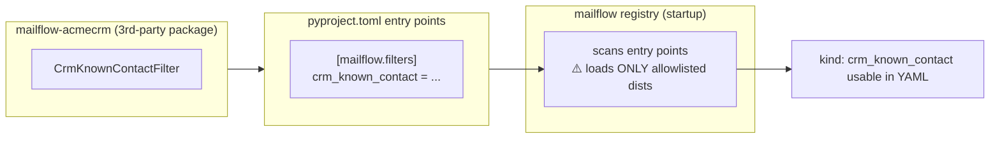


> 🔒 **Security gate (§9.6):** entry-point discovery is unauthenticated — any installed package can register under any group. [R-D6] We therefore **do not auto-load**. The registry loads only distributions on an explicit config allowlist (`plugins.allow: ["mailflow-acmecrm==1.2.0"]`), pinned and hash-verified. There is no built-in allowlist in the entry-point system, so this is our responsibility. [R-D6]

---

## 14. Versioning the contract

There are two separate "promises" we make to people who use this, and we version them separately so a change to one doesn't surprise the users of the other:

1. **The Python API** — the function and class shapes you use when you `import mailflow`. Versioned with standard SemVer (major.minor.patch); changing the shape of a port counts as a *major* change. Pin this if you import the library directly.
2. **The output format** — the shape of the `CleanEmail` / `EmailEvent` we emit. This is the *more* important one, because completely separate programs read it. Check its `schema_version` if you consume the emitted events.

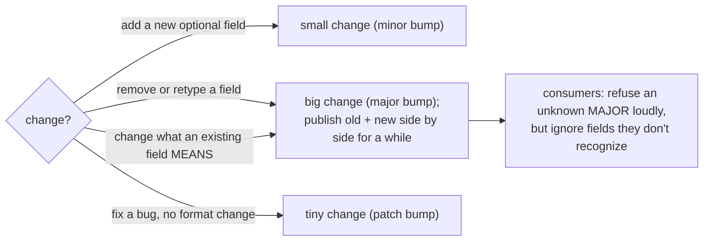


**Rules:**

- *Adding* a new optional field is a small (**minor**) change — existing consumers won't even notice. But **changing what an existing field means** — e.g. redefining what goes in `body_text` — is a big (**major**) change, even if its type stays the same, because it can silently break a consumer that's relying on the old meaning.
- Consumers should be **"tolerant readers,"** which just means: refuse loudly if the *major* version is one you don't recognize, but quietly *ignore* any extra fields you don't know about. (Version is `major.minor`; pin the major and require at least some minimum minor.)
  > **You might ask:** why "ignore unknown fields" instead of erroring on them? Because we add fields over time. If consumers crashed on anything new, every minor addition would break everyone — so we'd never be able to add anything. Ignoring unknowns is what lets the format grow without flag days.
- We publish the format as a **machine-readable JSON Schema file** — ideally as its own tiny package (`mailflow-schema`, auto-generated by pydantic [R-D7]) — so a program in a different repository can lock onto the exact format without having to install the whole heavy connector library.

---

## 15. Roadmap & honest estimate

> **Estimate:** for **one** engineer, the hardened Phase-1 scope is realistically **~6–9 weeks**. A ~2-week target is only feasible with **~3 engineers in parallel, the optional pieces descoped, and provider admin access pre-cleared**. The slip concentrates in the items that must *not* be cut (Graph auth/RBAC scoping, the webhook handshake, delta+resync correctness, heartbeat alerting) — several of which are gated on *other people* (Global Admin consent, Exchange admin, propagation delays of 30 min–2 h). Treat admin prerequisites as a **Phase 0 blocker that starts before the clock**.

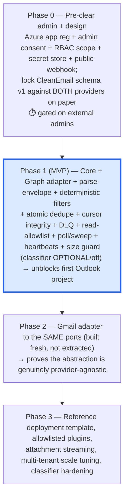


**Cuttable from v1 without touching invariants:** the LLM classifier (it's optional), Pub/Sub *and* Kafka emitters (ship `stdout`/`memory`/`webhook` first), and the plugin registry. **Not cuttable:** identity/idempotency, cursor integrity, DLQ, read-allowlist at the credential layer, schema versioning, size guard, heartbeat alerting.


| Day-0 prerequisites checklist (Graph)                                              | Owner                                   |
| ---------------------------------------------------------------------------------- | --------------------------------------- |
| Azure AD app registration + `Mail.Read` application permission + **admin consent** | Global Admin (cross-team)               |
| **RBAC for Applications** scope (mailbox group) + remove unscoped Entra grant      | Exchange admin (30 min–2 h propagation) |
| Federated identity credential / managed identity (avoid client secret)             | Cloud admin                             |
| Secret store entry + `secretAccessor` to the runtime identity                      | Cloud admin                             |
| Public HTTPS webhook URL (validation handshake reachable before subscription)      | Eng                                     |
| Cursor + dedupe + blob stores provisioned                                          | Eng                                     |


---

## 16. Open decisions, assumptions & uncertainties

*This section is for humans to resolve. Nothing below is settled by this document.*

### Open decisions (need a product/architecture call)

#### OD-1 Package name

`mailflow` is a placeholder. Pick the real name **before first release** — it's baked into import paths, config keys, entry-point groups (`[mailflow.providers]`), and secret-ref conventions; renaming later breaks every consumer.

#### OD-2 Drop vs flag for relevance

This doc defaults the LLM classifier to **flag (non-destructive)**, configurable to hard-drop. Confirm this is the desired default for a reusable toolkit (recommended: yes — dropping at ingest is irreversible and unobservable).

#### OD-3 Threading scope

Threading (conversation reconstruction / latest-reply isolation) is **out of scope**; we carry the RFC signals (`References`, `In-Reply-To`, normalized subject, participants) but don't compute threads. There is no email standard for quote formatting, so reliable latest-reply isolation is not generally solvable. Decide whether a *best-effort* JWZ-style threading helper [R-D2] belongs in the toolkit as an optional utility, or stays entirely with each consumer.

#### OD-4 Cursor/stream granularity for Graph

Graph delta is per-folder. Decide the watched-folder policy: Inbox-only (simplest, misses mail filed by server-side rules into other folders) vs. all folders (more streams, more subscriptions, closer to the 1,000/mailbox cap [R-A7]). Recommended v1: Inbox + a configurable folder list.

#### OD-5 Reference deployment topology

One tenant per process/instance (recommended for isolation, §9.4) vs. shared multi-tenant process (cheaper, weaker isolation). This interacts with the cold-start "build once" pattern — a shared process holding multiple tenants' secrets in memory is a leak surface.

#### OD-6 Rich vs basic Graph notifications

Basic notifications (pointer only, then re-fetch with our client) are simpler and have a 7-day subscription life; rich/encrypted notifications carry content but cut subscription life to ~1 day and add cert/JWT/decryption complexity. [R-A1][R-A5] Recommended v1: **basic** + re-fetch (also cleaner for the "trust nothing from payload" security rule).

#### OD-7 Buy vs build

Commercial unified-email APIs (Nylas, Unipile) and self-hostable EmailEngine already normalize Gmail+Graph. [R-D8] A short buy-vs-build evaluation (cost, data-residency/PII control, lock-in, the value of owning the pipeline) should precede committing to the build.

### Assumptions (please confirm)

- **A-1** Consuming apps run on GCP (Pub/Sub, Firestore, GCS appear as defaults). If Azure-hosted, the default stores/transports differ — the architecture supports it but the reference deployment and examples assume GCP.
- **A-2** Volumes are moderate (well under Graph's 10,000 req/10 min and Gmail's 6,000 units/min per mailbox). High-volume tenants need the resync/throttle tuning in Phase 3. [R-B2][R-C6]
- **A-3** App-only access (no per-user interactive consent at runtime) is acceptable and admins will grant it. If only per-user OAuth is permitted, the subscription/renewal model and token storage change materially.
- **A-4** A periodic scheduler (cron/Cloud Scheduler) is available for renewals and sweeps.

### Uncertainties (verify before relying)

#### U-1 Graph delta "sync from now"

The docs don't list Outlook `message` among resources supporting `deltatoken=latest` (skip the initial full pull). [R-B1] If true, the initial sync of a large mailbox walks history — confirm and bound it (§8.7). *(MEDIUM confidence — inferred from absence.)*

#### U-2 Graph message size

The v1.0 `message` resource exposes **no** `size` field [R-B6]; the `PidTagMessageSize` extended-property workaround is a community pattern, not on the official message page. **Verify against the SDK** before relying on it for the size guard (§8.6). Fallback: probe per-attachment `size` (which *is* documented). *(MEDIUM.)*

#### U-3 Application Access Policy deprecation timeline

Microsoft says AAP "will have deprecation announced in the future" but no firm end-of-support date is published. Build on **RBAC for Applications** now to avoid a forced migration. [R-B4] *(HIGH that RBAC is current; timeline date unknown.)*

#### U-4 PII lifecycle

Encryption-at-rest specifics, retention windows, and the right-to-erasure mechanism across dedupe + blob + downstream are **undesigned** (§9.7). Required before onboarding any real tenant; needs legal/compliance input.

#### U-5 Quota/limit drift

Provider quotas (Gmail 6,000 units/min, Graph 10,000/10 min, attachment thresholds) are current as of June 2026 but vendors revise them. Re-check at integration time. [R-B2][R-C6]

---

## 17. References

Confidence: **H** = directly quoted from official docs; **M** = official but inferred/secondary; **L** = no authoritative source.

**Microsoft Graph — notifications [R-A]**

- R-A1 (H) Subscription lifetimes (10,080 / 1,440 min for mail), 45-min floor, renewal, 3 s delivery window — learn.microsoft.com/graph/api/resources/subscription ; /graph/change-notifications-overview ; /graph/change-notifications-delivery-webhooks
- R-A2 (H) Validation handshake: `validationToken` echoed as `text/plain`, 200, ≤10 s — /graph/change-notifications-delivery-webhooks
- R-A3 (H) `clientState` ≤128 chars, must stay secret, validate on receipt — /graph/api/resources/subscription
- R-A4 (H) Lifecycle events (`reauthorizationRequired`/`subscriptionRemoved`/`missed`), `lifecycleNotificationUrl` required & not PATCH-able — /graph/change-notifications-lifecycle-events
- R-A5 (H) Notification payload shape; rich/encrypted notifications (AES-CBC/PKCS7, HMAC-SHA256, RSA-OAEP; cert RSA 2048–4096; appid `0bf30f3b-...`) — /graph/change-notifications-with-resource-data
- R-A7 (H) 1,000 active subscriptions per mailbox (all apps); 403 over-limit, 409 duplicate — /graph/change-notifications-overview

**Microsoft Graph — mail read/auth [R-B]**

- R-B1 (H) `messages/delta` per-folder; `@odata.nextLink`/`@odata.deltaLink`; 410 Gone (reset) vs 40X `syncStateNotFound` (expiry) → full resync; Outlook token has no fixed lifetime; replays possible — /graph/delta-query-overview ; /graph/api/message-delta
- R-B2 (H) Throttling: 10,000 req/10 min + 4 concurrent per app+mailbox; 429 + `Retry-After`; exp. backoff — /graph/throttling-limits ; /graph/throttling
- R-B3 (H) Attachments: `contentBytes` <3 MB, `/$value` ≥3 MB, ~4 MB request body, up to 150 MB, `attachment.size` — /graph/outlook-large-attachments ; /graph/api/attachment-get
- R-B4 (H) RBAC for Applications replaces (legacy) Application Access Policy; union gotcha; 30 min–2 h propagation — /exchange/permissions-exo/application-rbac ; /exchange/permissions-exo/application-access-policies
- R-B5 (H) Workload identity federation / federated identity credentials (avoid secrets) — /entra/workload-id/workload-identity-federation
- R-B6 (H/M) v1.0 `message` has no `size`; `PidTagMessageSize` ext-prop (M) / `mailboxItem.size` (beta) — /graph/api/resources/message

**Gmail / Google Cloud [R-C]**

- R-C1 (H) `users.watch` ~7-day expiry; renew daily — developers.google.com/gmail/api/guides/push
- R-C2 (H) Pub/Sub push payload `{emailAddress, historyId}`; OIDC JWT verification — /gmail/api/guides/push ; cloud.google.com/pubsub/docs/authenticate-push-subscriptions
- R-C3 (H) `history.list(startHistoryId)`; 404 → full sync; ~1-week availability — /gmail/api/guides/sync
- R-C4 (H) `format=raw` (base64url RFC 822), `sizeEstimate`, `attachments.get` — /gmail/api/reference/rest/v1/users.messages
- R-C5 (H) DWD vs per-user OAuth; scopes `gmail.readonly`/`metadata`; WIF to avoid SA keys — /identity/protocols/oauth2/service-account ; cloud.google.com/iam/docs/workload-identity-federation
- R-C6 (H) Pub/Sub 10 MB message cap; Gmail 6,000 units/min/user; exp. backoff — cloud.google.com/pubsub/quotas ; /gmail/api/reference/quota

**RFC / Python [R-D]**

- R-D1 (H) RFC 5322 §3.6.4: Message-ID optional (SHOULD); uniqueness is the generator's obligation — rfc-editor.org/rfc/rfc5322
- R-D2 (H) JWZ threading; IMAP THREAD = RFC 5256 — jwz.org/doc/threading.html
- R-D3 (H) From/Sender/Reply-To (5322), Auto-Submitted (3834), List-Id (2919), List-Unsubscribe (2369/8058)
- R-D4 (H) `cid:` (RFC 2392), Content-Disposition (RFC 2183), multipart/alternative, base64 ~33% — rfc-editor.org
- R-D5 (H) PEP 544 Protocols; `@runtime_checkable` checks member existence only, slow — peps.python.org/pep-0544
- R-D6 (H/M) `importlib.metadata.entry_points`; unauthenticated discovery = supply-chain risk; no built-in allowlist — packaging.python.org/guides/creating-and-discovering-plugins
- R-D7 (H) pydantic v2 `SecretStr`, `model_json_schema()` — docs.pydantic.dev
- R-D8 (H/M) Prior art: Nylas, Unipile (commercial), EmailEngine (self-host Node); pure-Python OSS niche appears empty

---

## 18. Decision log


| Date       | Decision                                                                                                            | Rationale                                                                                      |
| ---------- | ------------------------------------------------------------------------------------------------------------------- | ---------------------------------------------------------------------------------------------- |
| 2026-06-08 | Language = **Python**                                                                                               | Ecosystem fit for the consuming projects; rich email/MIME + pydantic + typing.Protocol support |
| 2026-06-08 | Scope = **Connect → Filter → Extract → Emit + invariants**                                                          | Storage/AI/notifications/UI stay in each app                                                   |
| 2026-06-08 | Delivery = **library + optional reference deployment**                                                              | Use any subset; fast path to production                                                        |
| 2026-06-08 | First provider = **Microsoft Graph (Outlook)**                                                                      | Near-term consuming projects use Outlook                                                       |
| 2026-06-08 | Gmail is a **Phase 2 adapter built to the same ports**                                                              | Proving the abstraction is genuinely provider-agnostic requires a real second implementation   |
| 2026-06-08 | **Idempotency keyed on `(tenant, mailbox, provider_message_id)`**; `Message-ID` is best-effort threading only       | RFC 5322: Message-ID may be absent/duplicate — unsafe as a unique key [R-D1]                   |
| 2026-06-08 | Pipeline: **parse-envelope before filters; full extract after KEEP**                                                | Filters need parsed fields; full body/attachment work runs only for kept mail                  |
| 2026-06-08 | Relevance classifier defaults to **flag, not drop**; destructive filters default **empty**                          | A reusable toolkit must not silently delete a consumer's legitimate mail                       |
| 2026-06-08 | Cursor advances on **terminal disposition**, monotonic CAS, single-writer per stream                                | Prevents poison-dedupe loops and cursor regression under push/poll concurrency                 |
| 2026-06-08 | Security boundary at the **credential/IAM layer** (RBAC for Applications / scoped OAuth + WIF)                      | In-process checks are bypassable; current MS guidance is RBAC, not AAP [R-B4]                  |
| 2026-06-08 | Plugins are **allowlisted**, never auto-loaded                                                                      | Entry-point discovery is an unauthenticated supply-chain surface [R-D6]                        |
| 2026-06-08 | Schema is **major.minor**, tolerant-reader, semantic changes need a major bump, published as a JSON Schema artifact | Cross-process consumers bind to the wire contract                                              |


---

*Diagrams render on GitHub, GitLab, VS Code, and Notion. Provider numbers verified against vendor docs as of June 2026 — re-check at integration time (U-5).*